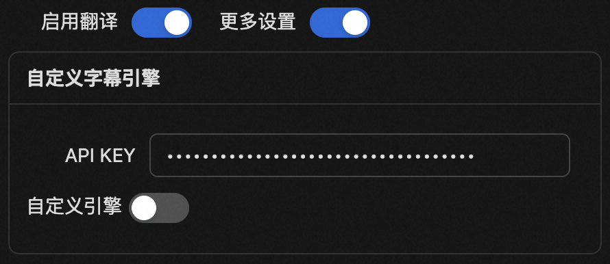

<div align="center" >
    
    <h1 align="center">auto-caption</h1>
    <p>Auto Caption 是一个跨平台的实时字幕显示软件。</p>
    <p>
        | <b>简体中文</b>
        | <a href="./README_en.md">English</a>
        | <a href="./README_ja.md">日本語</a> |
    </p>
    <p><i>v0.3.0版本已经发布。预计将添加本地字幕引擎的v1.0.0版本仍正在开发中...</i></p>
</div>


## 📥 下载

[GitHub Releases](https://github.com/HiMeditator/auto-caption/releases)

## 📚 相关文档

[Auto Caption 用户手册](./docs/user-manual/zh.md)

[字幕引擎说明文档](./docs/engine-manual/zh.md)

[项目 API 文档](./docs/api-docs/electron-ipc.md)

## 📖 基本使用

目前提供了 Windows 和 macOS 平台的可安装版本。如果要使用默认的 Gummy 字幕引擎，首先需要获取阿里云百炼平台的 API KEY，然后将 API KEY 添加到软件设置中或者配置到环境变量中（仅 Windows 平台支持读取环境变量中的 API KEY），这样才能正常使用该模型。



**国际版的阿里云服务并没有提供 Gummy 模型，因此目前非中国用户无法使用默认字幕引擎。我正在开发新的本地字幕引擎，以确保所有用户都有默认字幕引擎可以使用。**

相关教程：

- [获取 API KEY](https://help.aliyun.com/zh/model-studio/get-api-key)
- [将 API Key 配置到环境变量](https://help.aliyun.com/zh/model-studio/configure-api-key-through-environment-variables)

如果你想了解字幕引擎的工作原理，或者你想开发自己的字幕引擎，请参考[字幕引擎说明文档](./docs/engine-manual/zh.md)。
## ✨ 特性

- 跨平台、多界面语言支持
- 丰富的字幕样式设置
- 灵活的字幕引擎选择
- 多语言识别与翻译
- 字幕记录展示与导出
- 生成音频输出或麦克风输入的字幕

说明：
- Windows 和 macOS 平台支持生成音频输出和麦克风输入的字幕，但是 **macOS 平台获取系统音频输出需要进行设置，详见[Auto Caption 用户手册](./docs/user-manual/zh.md)**
- Linux 平台目前无法获取系统音频输出，仅支持生成麦克风输入的字幕

## ⚙️ 自带字幕引擎说明

目前软件自带 1 个字幕引擎，正在规划 2 个新的引擎。它们的详细信息如下。

### Gummy 字幕引擎（云端）

基于通义实验室[Gummy语音翻译大模型](https://help.aliyun.com/zh/model-studio/gummy-speech-recognition-translation/)进行开发，基于[阿里云百炼](https://bailian.console.aliyun.com)的 API 进行调用该云端模型。

**模型详细参数：**

- 音频采样率支持：16kHz及以上
- 音频采样位数：16bit
- 音频通道数支持：单通道
- 可识别语言：中文、英文、日语、韩语、德语、法语、俄语、意大利语、西班牙语
- 支持的翻译：
  - 中文 → 英文、日语、韩语
  - 英文 → 中文、日语、韩语
  - 日语、韩语、德语、法语、俄语、意大利语、西班牙语 → 中文或英文

**网络流量消耗：**

字幕引擎使用原生采样率（假设为 48kHz）进行采样，样本位深为 16bit，上传音频为为单通道，因此上传速率约为：

$$
48000\ \text{samples/second} \times 2\ \text{bytes/sample} \times 1\ \text{channel}  = 93.75\ \text{KB/s}
$$

而且引擎只会获取到音频流的时候才会上传数据，因此实际上传速率可能更小。模型结果回传流量消耗较小，没有纳入考虑。

### Vosk 字幕引擎（本地）

预计基于 [vosk-api](https://github.com/alphacep/vosk-api) 进行开发，正在实验中。

### FunASR 字幕引擎（本地）

如果可行，将基于 [FunASR](https://github.com/modelscope/FunASR) 进行开发。还未进行调研和可行性验证。

## 🚀 项目运行


### 安装依赖

```bash
npm install
```

### 构建字幕引擎

首先进入 `caption-engine` 文件夹，执行如下指令创建虚拟环境：

```bash
# in ./caption-engine folder
python -m venv subenv
# or
python3 -m venv subenv
```

然后激活虚拟环境：

```bash
# Windows
subenv/Scripts/activate
# Linux or macOS
source subenv/bin/activate
```

然后安装依赖（注意如果是 Linux 或 macOS 环境，需要注释掉 `requirements.txt` 中的 `PyAudioWPatch`，该模块仅适用于 Windows 环境）。

> 这一步可能会报错，一般是因为构建失败，需要根据报错信息安装对应的构建工具包。

```bash
pip install -r requirements.txt
```

然后使用 `pyinstaller` 构建项目：

```bash
pyinstaller --onefile main-gummy.py
```

此时项目构建完成，在进入 `caption-engine/dist` 文件夹可见对应的可执行文件。即可进行后续操作。

### 运行项目

```bash
npm run dev
```
### 构建项目

注意目前软件只在 Windows 和 macOS 平台上进行了构建和测试，无法保证软件在 Linux 平台下的正确性。

```bash
# For windows
npm run build:win
# For macOS
npm run build:mac
# For Linux
npm run build:linux
```
