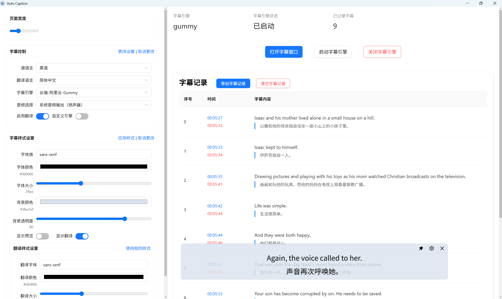

<div align="center" >
    
    <h1 align="center">auto-caption</h1>
    <p>Auto Caption 是一个跨平台的视频播放和字幕显示软件。</p>
    <b>项目初版已经开发完毕。</b>
</div>



## 📥 下载

[GitHub Releases](https://github.com/HiMeditator/auto-caption/releases)

## 📚 用户手册

暂无

### 基本使用

目前仅提供 Windows 平台的可安装版本。如果使用默认的 Gummy 字幕引擎，需要获取阿里云百炼平台的 API KEY 并配置到环境变量中才能正常使用该模型。相关教程：[获取API KEY](https://help.aliyun.com/zh/model-studio/get-api-key)、[将API Key配置到环境变量](https://help.aliyun.com/zh/model-studio/configure-api-key-through-environment-variables)。

对于开发者，可以自己创建新的字幕引擎。具体通信规范请参考源代码。
## ✨ 特性

- 丰富的字幕样式设置
- 灵活的字幕引擎选择
- 多语言识别与翻译
- 字幕记录展示与导出
- 生成音频输出和麦克风输入的字幕

说明：Windows 平台支持生成音频输出和麦克风输入的字幕，Linux 平台仅支持生成麦克风输入的字幕。

## 🚀 项目运行

### 安装依赖

```bash
npm install
```

### 构建字幕引擎

> #### 背景介绍
>
> 所谓的字幕引擎实际上是一个子程序，它会实时获取系统音频输入（录音）或输出（播放声音）的流式数据，并调用音频转文字的模型生成对应音频的字幕。生成的字幕通过 IPC 输出为转换为字符串的 JSON 数据，并返回给主程序。主程序读取字幕数据，处理后显示在窗口上。
>
>目前项目默认使用[阿里云 Gummy 模型](https://help.aliyun.com/zh/model-studio/gummy-speech-recognition-translation/)，需要获取阿里云百炼平台的 API KEY 并配置到环境变量中才能正常使用该模型，相关教程：[获取API KEY](https://help.aliyun.com/zh/model-studio/get-api-key)、[将API Key配置到环境变量](https://help.aliyun.com/zh/model-studio/configure-api-key-through-environment-variables)。
>
> 本项目的 gummy 字幕引擎是一个 python 子程序，通过 pyinstaller 打包为可执行文件。 运行字幕引擎子程序的代码在 `src\main\utils\engine.ts` 文件中。

首先进入 `python-subprocess` 文件夹，执行如下指令创建虚拟环境：

```bash
python -m venv subenv
```

然后激活虚拟环境：

```bash
# Windows
subenv/Scripts/activate
# Linux
source subenv/bin/activate
```

然后安装依赖（注意如果是 Linux 环境，需要注释调 `requirements.txt` 中的 `PyAudioWPatch`，该模块仅适用于 Windows 环境）：

```bash
pip install -r requirements.txt
```

然后使用 `pyinstaller` 构建项目：

```bash
pyinstaller --onefile main-gummy.py
```

此时项目构建完成，在进入 `python-subprocess/dist` 文件夹可见对应的可执行文件。即可进行后续操作。

### 运行项目

```bash
npm run dev
```
### 构建项目

注意目前软件没有适配 macOS 平台，请使用 Windows 或 Linux 系统进行构建。

```bash
# For windows
npm run build:win
# For macOS
npm run build:mac
# For Linux
npm run build:linux
```