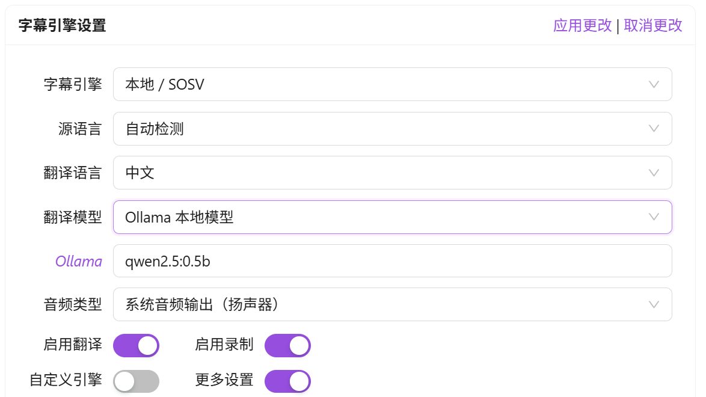

<div align="center" >
    
    <h1 align="center">auto-caption</h1>
    <p>Auto Caption 是一个跨平台的实时字幕显示软件。</p>
    <p>
      <a href="https://github.com/HiMeditator/auto-caption/releases"></a>
      <a href="https://github.com/HiMeditator/auto-caption/issues"></a>
      
      
      
    </p>
    <p>
        | <b>简体中文</b>
        | <a href="./README_en.md">English</a>
        | <a href="./README_ja.md">日本語</a> |
    </p>
    <p><i>v1.1.0 版本已经发布，新增 GLM-ASR 云端字幕模型和 OpenAI 兼容模型翻译...</i></p>
</div>


## 📥 下载

软件下载：[GitHub Releases](https://github.com/HiMeditator/auto-caption/releases)

Vosk 模型下载：[Vosk Models](https://alphacephei.com/vosk/models)

SOSV 模型下载：[ Shepra-ONNX SenseVoice Model](https://github.com/HiMeditator/auto-caption/releases/tag/sosv-model)

## 📚 相关文档

[Auto Caption 用户手册](./docs/user-manual/zh.md)

[字幕引擎说明文档](./docs/engine-manual/zh.md)

[更新日志](./docs/CHANGELOG.md)

## ✨ 特性

- 生成音频输出或麦克风输入的字幕
- 支持调用本地 Ollama 模型、云端 OpenAI 兼容模型、或云端 Google 翻译 API 进行翻译
- 跨平台（Windows、macOS、Linux）、多界面语言（中文、英语、日语）支持
- 丰富的字幕样式设置（字体、字体大小、字体粗细、字体颜色、背景颜色等）
- 灵活的字幕引擎选择（阿里云 Gummy 云端模型、GLM-ASR 云端模型、本地 Vosk 模型、本地 SOSV 模型、还可以自己开发模型）
- 多语言识别与翻译（见下文“⚙️ 自带字幕引擎说明”）
- 字幕记录展示与导出（支持导出 `.srt` 和 `.json` 格式）

## 📖 基本使用

> ⚠️ 注意：目前只维护了 Windows 平台的软件的最新版本，其他平台的最后版本停留在 v1.0.0。

软件已经适配了 Windows、macOS 和 Linux 平台。测试过的主流平台信息如下：

| 操作系统版本        | 处理器架构 | 获取系统音频输入 | 获取系统音频输出 |
| ------------------ | ---------- | ---------------- | ---------------- |
| Windows 11 24H2    | x64        | ✅               | ✅                |
| macOS Sequoia 15.5 | arm64      | ✅ [需要额外配置](./docs/user-manual/zh.md#macos-获取系统音频输出)     | ✅                |
| Ubuntu 24.04.2     | x64        | ✅               | ✅                |

macOS 平台和 Linux 平台获取系统音频输出需要进行额外设置，详见 [Auto Caption 用户手册](./docs/user-manual/zh.md)。

下载软件后，需要根据自己的需求选择对应的模型，然后配置模型。

|                                                              | 准确率 | 实时性 | 部署类型          | 支持语言   | 翻译       | 备注                                                       |
| ------------------------------------------------------------ | -------- | ------------- | ---------- | ---------- | ---------------------------------------------------------- | ---------------------------------------------------------- |
| [Gummy](https://help.aliyun.com/zh/model-studio/gummy-speech-recognition-translation) | 很好😊    | 很好😊 | 云端 / 阿里云 | 10 种      | 自带翻译   | 收费，0.54CNY / 小时                                       |
| [glm-asr-2512](https://docs.bigmodel.cn/cn/guide/models/sound-and-video/glm-asr-2512) | 很好😊 | 较差😞 | 云端 / 智谱 AI | 4 种 | 需额外配置 | 收费，约 0.72CNY / 小时 |
| [Vosk](https://alphacephei.com/vosk)                         | 较差😞    | 很好😊 | 本地 / CPU    | 超过 30 种 | 需额外配置 | 支持的语言非常多                                           |
| [SOSV](https://k2-fsa.github.io/sherpa/onnx/sense-voice/index.html) | 一般😐    | 一般😐 | 本地 / CPU    | 5 种       | 需额外配置 | 仅有一个模型                                               |
| 自己开发                                                     | 🤔        | 🤔      | 自定义        | 自定义     | 自定义     | 根据[文档](./docs/engine-manual/zh.md)使用 Python 自己开发 |

如果你选择的不是 Gummy 模型，你还需要配置自己的翻译模型。

### 配置翻译模型



> 注意：翻译不是实时的，翻译模型只会在每句话识别完成后再调用。

#### Ollama 本地模型

> 注意：使用参数量过大的模型会导致资源消耗和翻译延迟较大。建议使用参数量小于 1B 的模型，比如： `qwen2.5:0.5b`, `qwen3:0.6b`。

使用该模型之前你需要确定本机安装了 [Ollama](https://ollama.com/) 软件，并已经下载了需要的大语言模型。只需要将需要调用的大模型名称添加到设置中的 `模型名称` 字段中，并保证 `Base URL` 字段为空。

#### OpenAI 兼容模型

如果觉得本地 Ollama 模型的翻译效果不佳，或者不想在本地安装 Ollama 模型，那么可以使用云端的 OpenAI 兼容模型。

以下是一些模型提供商的 `Base URL`：
- OpenAI: https://api.openai.com/v1
- DeepSeek：https://api.deepseek.com
- 阿里云：https://dashscope.aliyuncs.com/compatible-mode/v1

API Key 需要在对应的模型提供商处获取。

#### Google 翻译 API

> 注意：Google 翻译 API 在无法访问国际网络的地区无法使用。

无需任何配置，联网即可使用。

### 使用 Gummy 模型

> 国际版的阿里云服务似乎并没有提供 Gummy 模型，因此目前非中国用户可能无法使用 Gummy 字幕引擎。

如果要使用默认的 Gummy 字幕引擎（使用云端模型进行语音识别和翻译），首先需要获取阿里云百炼平台的 API KEY，然后将 API KEY 添加到软件设置中（在字幕引擎设置的更多设置中）或者配置到环境变量中（仅 Windows 平台支持读取环境变量中的 API KEY），这样才能正常使用该模型。相关教程：

- [获取 API KEY](https://help.aliyun.com/zh/model-studio/get-api-key)
- [将 API Key 配置到环境变量](https://help.aliyun.com/zh/model-studio/configure-api-key-through-environment-variables)

### 使用 GLM-ASR 模型

使用前需要获取智谱 AI 平台的 API KEY，并添加到软件设置中。

API KEY 获取相关链接：[快速开始](https://docs.bigmodel.cn/cn/guide/start/quick-start)。

### 使用 Vosk 模型

> Vosk 模型的识别效果较差，请谨慎使用。

如果要使用 Vosk 本地字幕引擎，首先需要在 [Vosk Models](https://alphacephei.com/vosk/models) 页面下载你需要的模型，并将模型解压到本地，并将模型文件夹的路径添加到软件的设置中。


### 使用 SOSV 模型

使用 SOSV 模型的方式和 Vosk 一样，下载地址如下：https://github.com/HiMeditator/auto-caption/releases/tag/sosv-model

## ⌨️ 在终端中使用

软件采用模块化设计，可用分为软件主体和字幕引擎两部分，软件主体通过图形界面调用字幕引擎。核心的音频获取和音频识别功能都在字幕引擎中实现，而字幕引擎是可用脱离软件主体单独使用的。

字幕引擎使用 Python 开发，通过 PyInstaller 打包为可执行文件。因此字幕引擎有两种使用方式：

1. 使用项目字幕引擎部分的源代码，使用安装了对应库的 Python 环境进行运行
2. 使用打包好的字幕引擎的可执行文件，通过终端运行

运行参数和详细使用介绍请参考[用户手册](./docs/user-manual/zh.md#单独使用字幕引擎)。

```bash
python main.py \
-e gummy \
-k sk-******************************** \
-a 0 \
-d 1 \
-s en \
-t zh
```


## ⚙️ 自带字幕引擎说明

目前软件自带 4 个字幕引擎。它们的详细信息如下。

### Gummy 字幕引擎（云端）

基于通义实验室[Gummy语音翻译大模型](https://help.aliyun.com/zh/model-studio/gummy-speech-recognition-translation/)进行开发，基于[阿里云百炼](https://bailian.console.aliyun.com)的 API 进行调用该云端模型。

**模型详细参数：**

- 音频采样率支持：16kHz及以上
- 音频采样位数：16bit
- 音频通道数支持：单通道
- 可识别语言：中文、英文、日语、韩语、德语、法语、俄语、意大利语、西班牙语
- 支持的翻译：
  - 中文 → 英文、日语、韩语
  - 英文 → 中文、日语、韩语
  - 日语、韩语、德语、法语、俄语、意大利语、西班牙语 → 中文或英文

**网络流量消耗：**

字幕引擎使用原生采样率（假设为 48kHz）进行采样，样本位深为 16bit，上传音频为为单通道，因此上传速率约为：

$$
48000\ \text{samples/second} \times 2\ \text{bytes/sample} \times 1\ \text{channel}  = 93.75\ \text{KB/s}
$$

而且引擎只会获取到音频流的时候才会上传数据，因此实际上传速率可能更小。模型结果回传流量消耗较小，没有纳入考虑。

### GLM-ASR 字幕引擎（云端）

https://docs.bigmodel.cn/cn/guide/models/sound-and-video/glm-asr-2512

### Vosk 字幕引擎（本地）

基于 [vosk-api](https://github.com/alphacep/vosk-api) 开发。该字幕引擎的优点是可选的语言模型非常多（超过 30 种），缺点是识别效果比较差，且生成内容没有标点符号。


### SOSV 字幕引擎（本地）

[SOSV](https://github.com/HiMeditator/auto-caption/releases/tag/sosv-model) 是一个整合包，该整合包主要基于 [Shepra-ONNX SenseVoice](https://k2-fsa.github.io/sherpa/onnx/sense-voice/index.html)，并添加了端点检测模型和标点恢复模型。该模型支持识别的语言有：英语、中文、日语、韩语、粤语。

## 🚀 项目运行


### 安装依赖

```bash
npm install
```

### 构建字幕引擎

首先进入 `engine` 文件夹，执行如下指令创建虚拟环境（需要使用大于等于 Python 3.10 的 Python 运行环境，建议使用 Python 3.12）：

```bash
cd ./engine
# in ./engine folder
python -m venv .venv
# or
python3 -m venv .venv
```

然后激活虚拟环境：

```bash
# Windows
.venv/Scripts/activate
# Linux or macOS
source .venv/bin/activate
```

然后安装依赖（这一步在 macOS 和 Linux 可能会报错，一般是因为构建失败，需要根据报错信息进行处理）：

```bash
pip install -r requirements.txt
```

然后使用 `pyinstaller` 构建项目：

```bash
pyinstaller ./main.spec
```

注意 `main.spec` 文件中 `vosk` 库的路径可能不正确，需要根据实际状况配置（与 Python 环境的版本相关）。

```
# Windows
vosk_path = str(Path('./.venv/Lib/site-packages/vosk').resolve())
# Linux or macOS
vosk_path = str(Path('./.venv/lib/python3.x/site-packages/vosk').resolve())
```

此时项目构建完成，进入 `engine/dist` 文件夹可见对应的可执行文件。即可进行后续操作。

### 运行项目

```bash
npm run dev
```

### 构建项目

```bash
# For windows
npm run build:win
# For macOS
npm run build:mac
# For Linux
npm run build:linux
```
