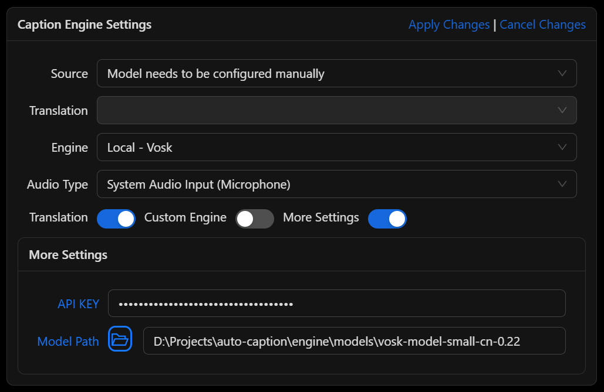
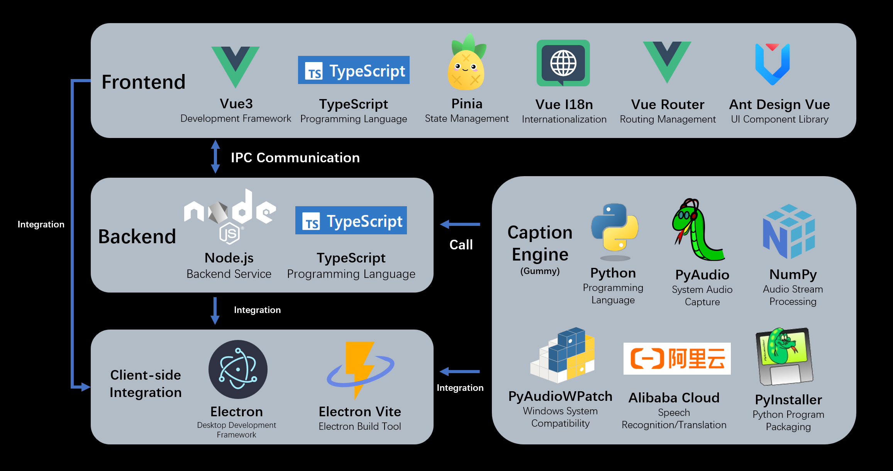

<div align="center" >
    
    <h1 align="center">auto-caption</h1>
    <p>Auto Caption is a cross-platform real-time caption display software.</p>
    <p>
      <a href="https://github.com/HiMeditator/auto-caption/releases"></a>
      <a href="https://github.com/HiMeditator/auto-caption/issues"></a>
      
      
      
    </p>
    <p>
        | <a href="./README.md">简体中文</a>
        | <b>English</b>
        | <a href="./README_ja.md">日本語</a> |
    </p>
    <p><i>Version 0.6.0 has been released, featuring a major refactor of the subtitle engine code to improve code extensibility. More subtitle engines are being developed...</i></p>
</div>


## 📥 Download

[GitHub Releases](https://github.com/HiMeditator/auto-caption/releases)

## 📚 Documentation

[Auto Caption User Manual](./docs/user-manual/en.md)

[Caption Engine Documentation](./docs/engine-manual/en.md)

[Project API Documentation (Chinese)](./docs/api-docs/)

[Changelog](./docs/CHANGELOG.md)

## 📖 Basic Usage

The software has been adapted for Windows, macOS, and Linux platforms. The tested platform information is as follows:

| OS Version         | Architecture | System Audio Input | System Audio Output |
| ------------------ | ------------ | ------------------ | ------------------- |
| Windows 11 24H2    | x64          | ✅                 | ✅                   |
| macOS Sequoia 15.5 | arm64        | ✅ Additional config required | ✅        |
| Ubuntu 24.04.2     | x64          | ✅                 | ✅                   |
| Kali Linux 2022.3  | x64          | ✅                 | ✅                   |
| Kylin Server V10 SP3 | x64 | ✅ | ✅ |

Additional configuration is required to capture system audio output on macOS and Linux platforms. See [Auto Caption User Manual](./docs/user-manual/en.md) for details.

> The international version of Alibaba Cloud services does not provide the Gummy model, so non-Chinese users currently cannot use the Gummy caption engine.

To use the default Gummy caption engine (which uses cloud-based models for speech recognition and translation), you first need to obtain an API KEY from the Alibaba Cloud Bailian platform. Then add the API KEY to the software settings or configure it in environment variables (only Windows platform supports reading API KEY from environment variables) to properly use this model. Related tutorials:

- [Obtaining API KEY (Chinese)](https://help.aliyun.com/zh/model-studio/get-api-key)
- [Configuring API Key through Environment Variables (Chinese)](https://help.aliyun.com/zh/model-studio/configure-api-key-through-environment-variables)

> The recognition performance of Vosk models is suboptimal, please use with caution.

To use the Vosk local caption engine, first download your required model from [Vosk Models](https://alphacephei.com/vosk/models) page, extract the model locally, and add the model folder path to the software settings. Currently, the Vosk caption engine does not support translated captions.



**If you find the above caption engines don't meet your needs and you know Python, you may consider developing your own caption engine. For detailed instructions, please refer to the [Caption Engine Documentation](./docs/engine-manual/en.md).**

## ✨ Features

- Cross-platform, multi-language UI support
- Rich caption style settings
- Flexible caption engine selection
- Multi-language recognition and translation
- Caption recording display and export
- Generate captions for audio output or microphone input

## ⚙️ Built-in Subtitle Engines

Currently, the software comes with 2 subtitle engines, with new engines under development. Their detailed information is as follows.

### Gummy Subtitle Engine (Cloud)

Developed based on Tongyi Lab's [Gummy Speech Translation Model](https://help.aliyun.com/zh/model-studio/gummy-speech-recognition-translation/), using [Alibaba Cloud Bailian](https://bailian.console.aliyun.com) API to call this cloud model.

**Model Parameters:**

- Supported audio sample rate: 16kHz and above
- Audio sample depth: 16bit
- Supported audio channels: Mono
- Recognizable languages: Chinese, English, Japanese, Korean, German, French, Russian, Italian, Spanish
- Supported translations:
  - Chinese → English, Japanese, Korean
  - English → Chinese, Japanese, Korean
  - Japanese, Korean, German, French, Russian, Italian, Spanish → Chinese or English

**Network Traffic Consumption:**

The subtitle engine uses native sample rate (assumed to be 48kHz) for sampling, with 16bit sample depth and mono channel, so the upload rate is approximately:

$$
48000\ \text{samples/second} \times 2\ \text{bytes/sample} \times 1\ \text{channel}  = 93.75\ \text{KB/s}
$$

The engine only uploads data when receiving audio streams, so the actual upload rate may be lower. The return traffic consumption of model results is small and not considered here.

### Vosk Subtitle Engine (Local)

Developed based on [vosk-api](https://github.com/alphacep/vosk-api). Currently only supports generating original text from audio, does not support translation content.

### Planned New Subtitle Engines

The following are candidate models that will be selected based on model performance and ease of integration.

- [faster-whisper](https://github.com/SYSTRAN/faster-whisper)
- [sherpa-onnx](https://github.com/k2-fsa/sherpa-onnx)
- [SenseVoice](https://github.com/FunAudioLLM/SenseVoice)
- [FunASR](https://github.com/modelscope/FunASR)

## 🚀 Project Setup



### Install Dependencies

```bash
npm install
```

### Build Subtitle Engine

First enter the `engine` folder and execute the following commands to create a virtual environment (requires Python 3.10 or higher, with Python 3.12 recommended):

```bash
# in ./engine folder
python -m venv .venv
# or
python3 -m venv .venv
```

Then activate the virtual environment:

```bash
# Windows
.venv/Scripts/activate
# Linux or macOS
source .venv/bin/activate
```

Then install dependencies (this step might result in errors on macOS and Linux, usually due to build failures, and you need to handle them based on the error messages):

```bash
pip install -r requirements.txt
```

If you encounter errors when installing the `samplerate` module on Linux systems, you can try installing it separately with this command:

```bash
pip install samplerate --only-binary=:all:
```

Then use `pyinstaller` to build the project:

```bash
pyinstaller ./main.spec
```

Note that the path to the `vosk` library in `main-vosk.spec` might be incorrect and needs to be configured according to the actual situation (related to the version of the Python environment).

```
# Windows
vosk_path = str(Path('./.venv/Lib/site-packages/vosk').resolve())
# Linux or macOS
vosk_path = str(Path('./.venv/lib/python3.x/site-packages/vosk').resolve())
```

After the build completes, you can find the executable file in the `engine/dist` folder. Then proceed with subsequent operations.

### Run Project

```bash
npm run dev
```

### Build Project

```bash
# For windows
npm run build:win
# For macOS
npm run build:mac
# For Linux
npm run build:linux
```

Note: You need to modify the configuration content in the `electron-builder.yml` file in the project root directory according to different platforms:

```yml
extraResources:
  # For Windows
  - from: ./engine/dist/main.exe
    to: ./engine/main.exe
  # For macOS and Linux
  # - from: ./engine/dist/main
  #   to: ./engine/main
```