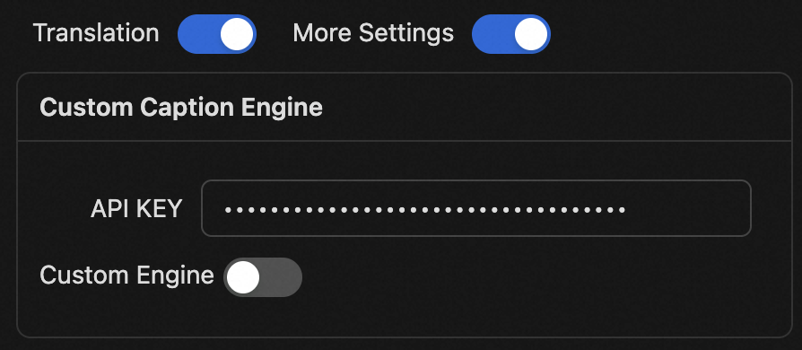

<div align="center" >
    
    <h1 align="center">auto-caption</h1>
    <p>Auto Caption is a cross-platform real-time caption display software.</p>
    <p>
      
      
      
      
      
    </p>
    <p>
        | <a href="./README.md">简体中文</a>
        | <b>English</b>
        | <a href="./README_ja.md">日本語</a> |
    </p>
    <p><i>Version v0.3.0 has been released. Version v1.0.0, which is expected to add a local caption engine, is still under development...</i></p>
</div>


## 📥 Download

[GitHub Releases](https://github.com/HiMeditator/auto-caption/releases)

## 📚 Documentation

[Auto Caption User Manual](./docs/user-manual/en.md)

[Caption Engine Documentation](./docs/engine-manual/en.md)

[Project API Documentation (Chinese)](./docs/api-docs/electron-ipc.md)

## 📖 Basic Usage

Currently, installable versions are provided for Windows and macOS platforms. To use the default Gummy caption engine, you first need to obtain an API KEY from Alibaba Cloud Bailian platform, then add the API KEY to the software settings or configure it in environment variables (only Windows platform supports reading API KEY from environment variables) to enable normal usage of this model.



**The international version of Alibaba Cloud services does not provide the Gummy model, so currently non-Chinese users cannot use the default caption engine. I'm developing a new local caption engine to ensure all users have a default caption engine available.**

Related tutorials:

- [Obtain API KEY (Chinese)](https://help.aliyun.com/zh/model-studio/get-api-key)
- [Configure API Key in Environment Variables (Chinese)](https://help.aliyun.com/zh/model-studio/configure-api-key-through-environment-variables)

If you want to understand how the caption engine works, or if you want to develop your own caption engine, please refer to [Caption Engine Documentation](./docs/engine-manual/en.md).

## ✨ Features

- Cross-platform, multi-language UI support
- Rich caption style settings
- Flexible caption engine selection
- Multi-language recognition and translation
- Caption recording display and export
- Generate captions for audio output or microphone input

Notes:
- Windows and macOS platforms support generating captions for both audio output and microphone input, but **macOS requires additional setup to capture system audio output. See [Auto Caption User Manual](./docs/user-manual/en.md) for details.**
- Linux platform currently cannot capture system audio output, only supports generating subtitles for microphone input.

## ⚙️ Built-in Subtitle Engines

Currently, the software comes with 1 subtitle engine, with 2 new engines planned. Details are as follows.

### Gummy Subtitle Engine (Cloud)

Developed based on Tongyi Lab's [Gummy Speech Translation Model](https://help.aliyun.com/zh/model-studio/gummy-speech-recognition-translation/), using [Alibaba Cloud Bailian](https://bailian.console.aliyun.com) API to call this cloud model.

**Model Parameters:**

- Supported audio sample rate: 16kHz and above
- Audio sample depth: 16bit
- Supported audio channels: Mono
- Recognizable languages: Chinese, English, Japanese, Korean, German, French, Russian, Italian, Spanish
- Supported translations:
  - Chinese → English, Japanese, Korean
  - English → Chinese, Japanese, Korean
  - Japanese, Korean, German, French, Russian, Italian, Spanish → Chinese or English

**Network Traffic Consumption:**

The subtitle engine uses native sample rate (assumed to be 48kHz) for sampling, with 16bit sample depth and mono channel, so the upload rate is approximately:

$$
48000\ \text{samples/second} \times 2\ \text{bytes/sample} \times 1\ \text{channel}  = 93.75\ \text{KB/s}
$$

The engine only uploads data when receiving audio streams, so the actual upload rate may be lower. The return traffic consumption of model results is small and not considered here.

### Vosk Subtitle Engine (Local)

Planned to be developed based on [vosk-api](https://github.com/alphacep/vosk-api), currently in experimentation.

### FunASR Subtitle Engine (Local)

If feasible, will be developed based on [FunASR](https://github.com/modelscope/FunASR). Not yet researched or verified for feasibility.

## 🚀 Project Setup


### Install Dependencies

```bash
npm install
```

### Build Subtitle Engine

First enter the `caption-engine` folder and execute the following commands to create a virtual environment:

```bash
# in ./caption-engine folder
python -m venv subenv
# or
python3 -m venv subenv
```

Then activate the virtual environment:

```bash
# Windows
subenv/Scripts/activate
# Linux or macOS
source subenv/bin/activate
```

Then install dependencies (note: for Linux or macOS environments, you need to comment out `PyAudioWPatch` in `requirements.txt`, as this module is only for Windows environments).

> This step may report errors, usually due to build failures. You need to install corresponding build tools based on the error messages.

```bash
pip install -r requirements.txt
```

Then use `pyinstaller` to build the project:

```bash
pyinstaller --onefile main-gummy.py
```

After the build completes, you can find the executable file in the `caption-engine/dist` folder. Then proceed with subsequent operations.

### Run Project

```bash
npm run dev
```

### Build Project

Note: Currently the software has only been built and tested on Windows and macOS platforms. Correct operation on Linux platform is not guaranteed.

```bash
# For windows
npm run build:win
# For macOS
npm run build:mac
# For Linux
npm run build:linux
```
