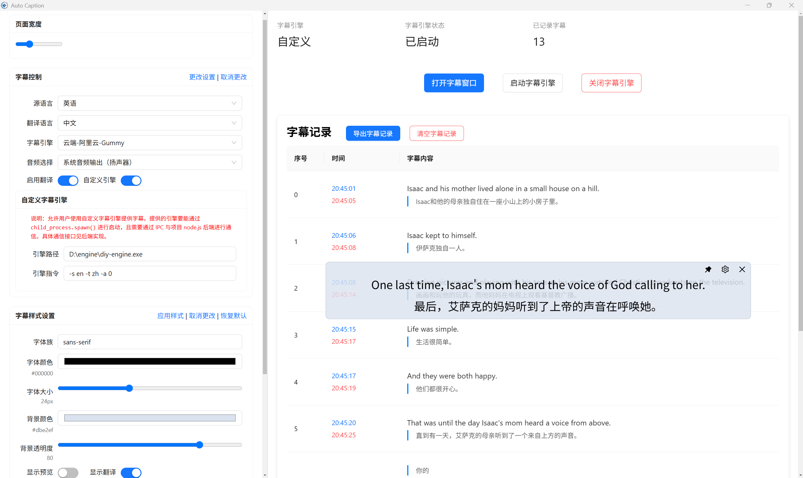

<div align="center" >
    
    <h1 align="center">auto-caption</h1>
    <p>Auto Caption is a cross-platform real-time subtitle display software.</p>
    <p>
        | <a href="https://github.com/HiMeditator/auto-caption/blob/main/README.md">简体中文</a>
        | <b>English</b> |
    </p>
</div>

<p style="color:red;text-align:center;">The development of the new version is underway, featuring a local subtitle engine, English/Japanese internationalization, and a dark theme. It will also include fixes for known bugs and improvements to the user experience. It is expected to be released within this month.</p>



## ⚠️ Attention

**The current software interface language is Chinese. English adaptation has not been done yet.**

## 📥 Download

[GitHub Releases](https://github.com/HiMeditator/auto-caption/releases)

## 📚 User Manual

[Auto Caption User Manual (Chinese)](./assets/user-manual_en.md)

[Caption Engine Documentation (Chinese)](./assets/engine-manual_en.md)

### Basic Usage

Currently, only an installable version for the Windows platform is provided. If using the default Gummy subtitle engine, you need to obtain an API KEY from Alibaba Cloud's Bailian platform and configure it in the environment variables to use the model properly. Related tutorials: [Get API KEY](https://help.aliyun.com/zh/model-studio/get-api-key), [Configure API Key through Environment Variables](https://help.aliyun.com/zh/model-studio/configure-api-key-through-environment-variables).

For developers, you can create a new subtitle engine. For instructions on customizing the subtitle engine, please refer to the [Caption Engine Documentation (Chinese)](./assets/engine-manual_zh.md).


## ✨ Features

- Rich subtitle style settings
- Flexible subtitle engine selection
- Multi-language recognition and translation
- Subtitle record display and export
- Generate subtitles for audio output and microphone input

Note: The Windows platform supports generating subtitles for both audio output and microphone input, while the Linux platform only supports generating subtitles for microphone input.

## 🚀 Project Execution


### Install Dependencies

```bash
npm install
```

### Build Subtitle Engine

> #### Background
>
> If you are a developer and want to develop a custom subtitle engine, please refer to the [Caption Engine Documentation (Chinese)](./assets/engine-manual_zh.md).
>
> The so-called subtitle engine is actually a subprocess that will real-time acquire streaming data from system audio input (recording) or output (playing sound) and call an audio-to-text model to generate corresponding subtitles for the audio. The generated subtitles are output as JSON data converted to strings via IPC and returned to the main program. The main program reads the subtitle data, processes it, and displays it on the window.
>
> Currently, the project uses the [Alibaba Cloud Gummy Model](https://help.aliyun.com/zh/model-studio/gummy-speech-recognition-translation/) by default, which requires obtaining an API KEY from Alibaba Cloud's Bailian platform and configuring it in the environment variables to function properly. Related tutorials: [Get API KEY](https://help.aliyun.com/zh/model-studio/get-api-key), [Configure API Key through Environment Variables](https://help.aliyun.com/zh/model-studio/configure-api-key-through-environment-variables).
>
> The gummy subtitle engine in this project is a Python subprocess, packaged into an executable file using pyinstaller. The code for running the subtitle engine subprocess is in the `src\main\utils\engine.ts` file.

First, enter the `caption-engine` folder and execute the following command to create a virtual environment:

```bash
python -m venv subenv
```

Then activate the virtual environment:

```bash
# Windows
subenv/Scripts/activate
# Linux
source subenv/bin/activate
```

Then install the dependencies (note that if you are in a Linux environment, you need to comment out `PyAudioWPatch` in `requirements.txt`, as this module is only applicable to the Windows environment):

```bash
pip install -r requirements.txt
```

Then build the project using `pyinstaller`:

```bash
pyinstaller --onefile main-gummy.py
```

At this point, the project is built. You can find the corresponding executable file in the `caption-engine/dist` folder. You can proceed with further operations.

### Run the Project

```bash
npm run dev
```

### Build the Project

Please note that the software is currently not compatible with the macOS platform. Use Windows or Linux systems for building, with Windows being more recommended as it implements the full set of features.


```bash
# For Windows
npm run build:win
# For macOS
npm run build:mac
# For Linux
npm run build:linux
```
