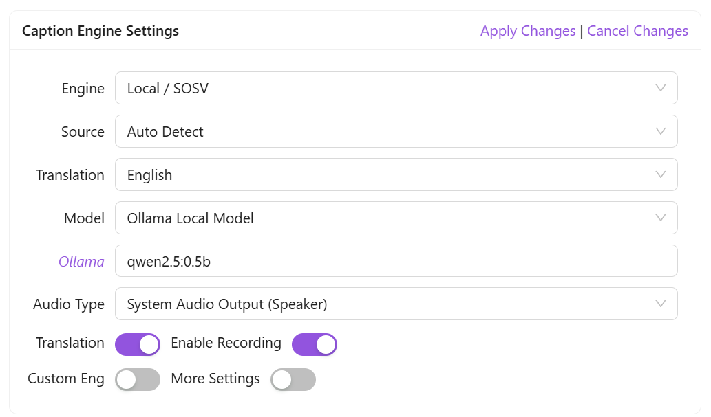
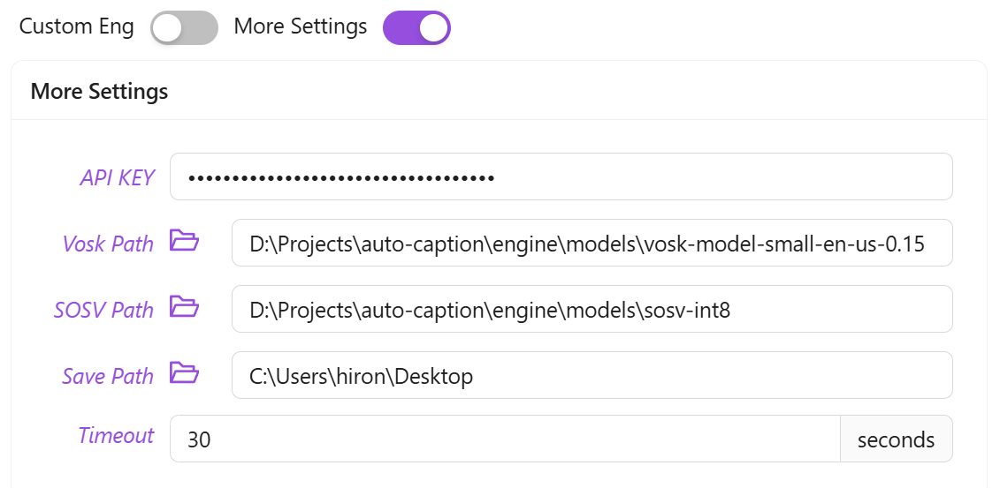

<div align="center" >
    
    <h1 align="center">auto-caption</h1>
    <p>Auto Caption is a cross-platform real-time caption display software.</p>
    <p>
      <a href="https://github.com/HiMeditator/auto-caption/releases"></a>
      <a href="https://github.com/HiMeditator/auto-caption/issues"></a>
      
      
      
    </p>
    <p>
        | <a href="./README.md">简体中文</a>
        | <b>English</b>
        | <a href="./README_ja.md">日本語</a> |
    </p>
    <p><i>Version 1.0.0 has been released, with the addition of the SOSV local caption model. More caption models are being developed...</i></p>
</div>


## 📥 Download

Software Download: [GitHub Releases](https://github.com/HiMeditator/auto-caption/releases)

Vosk Model Download: [Vosk Models](https://alphacephei.com/vosk/models)

SOSV Model Download: [Shepra-ONNX SenseVoice Model](https://github.com/HiMeditator/auto-caption/releases/tag/sosv-model)

## 📚 Documentation

[Auto Caption User Manual](./docs/user-manual/en.md)

[Caption Engine Documentation](./docs/engine-manual/en.md)

[Changelog](./docs/CHANGELOG.md)

## ✨ Features

- Generate captions from audio output or microphone input
- Supports translation by calling local Ollama models or cloud-based Google Translate API
- Cross-platform (Windows, macOS, Linux) and multi-language interface (Chinese, English, Japanese) support
- Rich caption style settings (font, font size, font weight, font color, background color, etc.)
- Flexible caption engine selection (Alibaba Cloud Gummy cloud model, local Vosk model, local SOSV model, or you can develop your own model)
- Multi-language recognition and translation (see below "⚙️ Built-in Subtitle Engines")
- Subtitle record display and export (supports exporting `.srt` and `.json` formats)

## 📖 Basic Usage

The software has been adapted for Windows, macOS, and Linux platforms. The tested platform information is as follows:

| OS Version         | Architecture | System Audio Input | System Audio Output |
| ------------------ | ------------ | ------------------ | ------------------- |
| Windows 11 24H2    | x64          | ✅                 | ✅                   |
| macOS Sequoia 15.5 | arm64        | ✅ [Additional config required](./docs/user-manual/en.md#capturing-system-audio-output-on-macos) | ✅        |
| Ubuntu 24.04.2     | x64          | ✅                 | ✅                   |

Additional configuration is required to capture system audio output on macOS and Linux platforms. See [Auto Caption User Manual](./docs/user-manual/en.md) for details.


After downloading the software, you need to select the corresponding model according to your needs and then configure the model.

|                                                              | Recognition Quality | Deployment Type    | Supported Languages | Translation   | Notes                                                      |
| ------------------------------------------------------------ | ------------------- | ------------------ | ------------------- | ------------- | ---------------------------------------------------------- |
| [Gummy](https://help.aliyun.com/zh/model-studio/gummy-speech-recognition-translation) | Excellent 😊         | Alibaba Cloud | 10 languages        | Built-in      | Paid, 0.54 CNY/hour                                        |
| [Vosk](https://alphacephei.com/vosk)                         | Poor 😞             | Local / CPU        | Over 30 languages   | Requires setup | Supports many languages                                    |
| [SOSV](https://k2-fsa.github.io/sherpa/onnx/sense-voice/index.html) | Fair 😐             | Local / CPU        | 5 languages         | Requires setup | Only one model available                                   |
| DIY Development                                              | 🤔                  | Custom             | Custom              | Custom        | Develop your own using Python according to [documentation](./docs/engine-manual/zh.md) |

If you choose to use the Vosk or SOSV model, you also need to configure your own translation model.

### Configuring Translation Models



> Note: Translation is not real-time. The translation model is only called after each sentence recognition is completed.

#### Ollama Local Model

> Note: Using models with too many parameters will lead to high resource consumption and translation delays. It is recommended to use models with less than 1B parameters, such as: `qwen2.5:0.5b`, `qwen3:0.6b`.

Before using this model, you need to ensure that [Ollama](https://ollama.com/) software is installed on your machine and the required large language model has been downloaded. Simply add the name of the large model you want to call to the `Ollama` field in the settings.

#### Google Translate API

> Note: Google Translate API is not available in some regions.

No configuration required, just connect to the internet to use.

### Using Gummy Model

> The international version of Alibaba Cloud services does not seem to provide the Gummy model, so non-Chinese users may not be able to use the Gummy caption engine at present.

To use the default Gummy caption engine (using cloud models for speech recognition and translation), you first need to obtain an API KEY from Alibaba Cloud Bailian platform, then add the API KEY to the software settings or configure it in the environment variables (only Windows platform supports reading API KEY from environment variables), so that the model can be used normally. Related tutorials:

- [Get API KEY](https://help.aliyun.com/zh/model-studio/get-api-key)
- [Configure API Key through Environment Variables](https://help.aliyun.com/zh/model-studio/configure-api-key-through-environment-variables)

### Using Vosk Model

> The recognition effect of the Vosk model is poor, please use it with caution.

To use the Vosk local caption engine, first download the model you need from the [Vosk Models](https://alphacephei.com/vosk/models) page, unzip the model locally, and add the path of the model folder to the software settings.



### Using SOSV Model

The way to use the SOSV model is the same as Vosk. The download address is as follows: https://github.com/HiMeditator/auto-caption/releases/tag/sosv-model

## ⚙️ Built-in Subtitle Engines

Currently, the software comes with 3 caption engines, with new engines under development. Their detailed information is as follows.

### Gummy Subtitle Engine (Cloud)

Developed based on Tongyi Lab's [Gummy Speech Translation Model](https://help.aliyun.com/zh/model-studio/gummy-speech-recognition-translation/), using [Alibaba Cloud Bailian](https://bailian.console.aliyun.com) API to call this cloud model.

**Model Parameters:**

- Supported audio sample rate: 16kHz and above
- Audio sample depth: 16bit
- Supported audio channels: Mono
- Recognizable languages: Chinese, English, Japanese, Korean, German, French, Russian, Italian, Spanish
- Supported translations:
  - Chinese → English, Japanese, Korean
  - English → Chinese, Japanese, Korean
  - Japanese, Korean, German, French, Russian, Italian, Spanish → Chinese or English

**Network Traffic Consumption:**

The caption engine uses native sample rate (assumed to be 48kHz) for sampling, with 16bit sample depth and mono channel, so the upload rate is approximately:

$$
48000\ \text{samples/second} \times 2\ \text{bytes/sample} \times 1\ \text{channel}  = 93.75\ \text{KB/s}
$$

The engine only uploads data when receiving audio streams, so the actual upload rate may be lower. The return traffic consumption of model results is small and not considered here.

### Vosk Subtitle Engine (Local)

Developed based on [vosk-api](https://github.com/alphacep/vosk-api). The advantage of this caption engine is that there are many optional language models (over 30 languages), but the disadvantage is that the recognition effect is relatively poor, and the generated content has no punctuation.

### SOSV Subtitle Engine (Local)

[SOSV](https://github.com/HiMeditator/auto-caption/releases/tag/sosv-model) is an integrated package, mainly based on [Shepra-ONNX SenseVoice](https://k2-fsa.github.io/sherpa/onnx/sense-voice/index.html), with added endpoint detection model and punctuation restoration model. The languages supported by this model for recognition are: English, Chinese, Japanese, Korean, and Cantonese.

### Planned New Subtitle Engines

The following are candidate models that will be selected based on model performance and ease of integration.

- [faster-whisper](https://github.com/SYSTRAN/faster-whisper)
- [sherpa-onnx](https://github.com/k2-fsa/sherpa-onnx)
- [SenseVoice](https://github.com/FunAudioLLM/SenseVoice)
- [FunASR](https://github.com/modelscope/FunASR)
- [WhisperLiveKit](https://github.com/QuentinFuxa/WhisperLiveKit)

## 🚀 Project Setup


### Install Dependencies

```bash
npm install
```

### Build Subtitle Engine

First enter the `engine` folder and execute the following commands to create a virtual environment (requires Python 3.10 or higher, with Python 3.12 recommended):

```bash
cd ./engine
# in ./engine folder
python -m venv .venv
# or
python3 -m venv .venv
```

Then activate the virtual environment:

```bash
# Windows
.venv/Scripts/activate
# Linux or macOS
source .venv/bin/activate
```

Then install dependencies (this step might result in errors on macOS and Linux, usually due to build failures, and you need to handle them based on the error messages):

```bash
pip install -r requirements.txt
```

Then use `pyinstaller` to build the project:

```bash
pyinstaller ./main.spec
```

Note that the path to the `vosk` library in `main-vosk.spec` might be incorrect and needs to be configured according to the actual situation (related to the version of the Python environment).

```
# Windows
vosk_path = str(Path('./.venv/Lib/site-packages/vosk').resolve())
# Linux or macOS
vosk_path = str(Path('./.venv/lib/python3.x/site-packages/vosk').resolve())
```

After the build completes, you can find the executable file in the `engine/dist` folder. Then proceed with subsequent operations.

### Run Project

```bash
npm run dev
```

### Build Project

```bash
# For windows
npm run build:win
# For macOS
npm run build:mac
# For Linux
npm run build:linux
```
