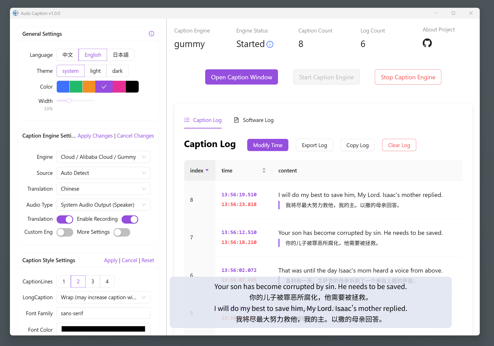

<div align="center" >
    
    <h1 align="center">auto-caption</h1>
    <p>Auto Caption is a cross-platform real-time caption display software.</p>
    <p>
      <a href="https://github.com/HiMeditator/auto-caption/releases">
        
      </a>
      <a href="https://github.com/HiMeditator/auto-caption/issues">
        
      </a>
      
      
      
    </p>
    <p>
        | <a href="./README.md">简体中文</a>
        | <b>English</b>
        | <a href="./README_ja.md">日本語</a> |
    </p>
    <p><i>The v0.4.0 version with Vosk local caption engine has been released. <b>Currently the local caption engine does not include translation</b>, the local translation module is still under development...</i></p>
</div>



## 📥 Download

[GitHub Releases](https://github.com/HiMeditator/auto-caption/releases)

## 📚 Documentation

[Auto Caption User Manual](./docs/user-manual/en.md)

[Caption Engine Documentation](./docs/engine-manual/en.md)

[Project API Documentation (Chinese)](./docs/api-docs/electron-ipc.md)

## 📖 Basic Usage

Currently, installable versions are available for Windows and macOS platforms.

> The international version of Alibaba Cloud services does not provide the Gummy model, so non-Chinese users currently cannot use the Gummy caption engine.

To use the default Gummy caption engine (which uses cloud-based models for speech recognition and translation), you first need to obtain an API KEY from the Alibaba Cloud Bailian platform. Then add the API KEY to the software settings or configure it in environment variables (only Windows platform supports reading API KEY from environment variables) to properly use this model. Related tutorials:

- [Obtaining API KEY (Chinese)](https://help.aliyun.com/zh/model-studio/get-api-key)
- [Configuring API Key through Environment Variables (Chinese)](https://help.aliyun.com/zh/model-studio/configure-api-key-through-environment-variables)

> The recognition performance of Vosk models is suboptimal, please use with caution.

To use the Vosk local caption engine, first download your required model from [Vosk Models](https://alphacephei.com/vosk/models) page, extract the model locally, and add the model folder path to the software settings. Currently, the Vosk caption engine does not support translated captions.


**If you find the above caption engines don't meet your needs and you know Python, you may consider developing your own caption engine. For detailed instructions, please refer to the [Caption Engine Documentation](./docs/engine-manual/en.md).**

## ✨ Features

- Cross-platform, multi-language UI support
- Rich caption style settings
- Flexible caption engine selection
- Multi-language recognition and translation
- Caption recording display and export
- Generate captions for audio output or microphone input

Notes:
- Windows and macOS platforms support generating captions for both audio output and microphone input, but **macOS requires additional setup to capture system audio output. See [Auto Caption User Manual](./docs/user-manual/en.md) for details.**
- Linux platform currently cannot capture system audio output, only supports generating subtitles for microphone input.

## ⚙️ Built-in Subtitle Engines

Currently, the software comes with 2 subtitle engines, with 1 new engine planned. Details are as follows.

### Gummy Subtitle Engine (Cloud)

Developed based on Tongyi Lab's [Gummy Speech Translation Model](https://help.aliyun.com/zh/model-studio/gummy-speech-recognition-translation/), using [Alibaba Cloud Bailian](https://bailian.console.aliyun.com) API to call this cloud model.

**Model Parameters:**

- Supported audio sample rate: 16kHz and above
- Audio sample depth: 16bit
- Supported audio channels: Mono
- Recognizable languages: Chinese, English, Japanese, Korean, German, French, Russian, Italian, Spanish
- Supported translations:
  - Chinese → English, Japanese, Korean
  - English → Chinese, Japanese, Korean
  - Japanese, Korean, German, French, Russian, Italian, Spanish → Chinese or English

**Network Traffic Consumption:**

The subtitle engine uses native sample rate (assumed to be 48kHz) for sampling, with 16bit sample depth and mono channel, so the upload rate is approximately:

$$
48000\ \text{samples/second} \times 2\ \text{bytes/sample} \times 1\ \text{channel}  = 93.75\ \text{KB/s}
$$

The engine only uploads data when receiving audio streams, so the actual upload rate may be lower. The return traffic consumption of model results is small and not considered here.

### Vosk Subtitle Engine (Local)

Developed based on [vosk-api](https://github.com/alphacep/vosk-api). Currently only supports generating original text from audio, does not support translation content.

### FunASR Subtitle Engine (Local)

If feasible, will be developed based on [FunASR](https://github.com/modelscope/FunASR). Not yet researched or verified for feasibility.

## 🚀 Project Setup


### Install Dependencies

```bash
npm install
```

### Build Subtitle Engine

First enter the `caption-engine` folder and execute the following commands to create a virtual environment:

```bash
# in ./caption-engine folder
python -m venv subenv
# or
python3 -m venv subenv
```

Then activate the virtual environment:

```bash
# Windows
subenv/Scripts/activate
# Linux or macOS
source subenv/bin/activate
```

Then install dependencies (note: for Linux or macOS environments, you need to comment out `PyAudioWPatch` in `requirements.txt`, as this module is only for Windows environments).

> This step may report errors, usually due to build failures. You need to install corresponding build tools based on the error messages.

```bash
pip install -r requirements.txt
```

Then use `pyinstaller` to build the project:

```bash
pyinstaller ./main-gummy.spec
pyinstaller ./main-vosk.spec
```

After the build completes, you can find the executable file in the `caption-engine/dist` folder. Then proceed with subsequent operations.

### Run Project

```bash
npm run dev
```

### Build Project

Note: Currently the software has only been built and tested on Windows and macOS platforms. Correct operation on Linux platform is not guaranteed.

```bash
# For windows
npm run build:win
# For macOS
npm run build:mac
# For Linux
npm run build:linux
```

Note: You need to modify the configuration content in the `electron-builder.yml` file in the project root directory according to different platforms:

```yml
extraResources:
  # For Windows
  - from: ./caption-engine/dist/main-gummy.exe
    to: ./caption-engine/main-gummy.exe
  - from: ./caption-engine/dist/main-vosk.exe
    to: ./caption-engine/main-vosk.exe
  # For macOS and Linux
  # - from: ./caption-engine/dist/main-gummy
  #   to: ./caption-engine/main-gummy
  # - from: ./caption-engine/dist/main-vosk
  #   to: ./caption-engine/main-vosk
```
