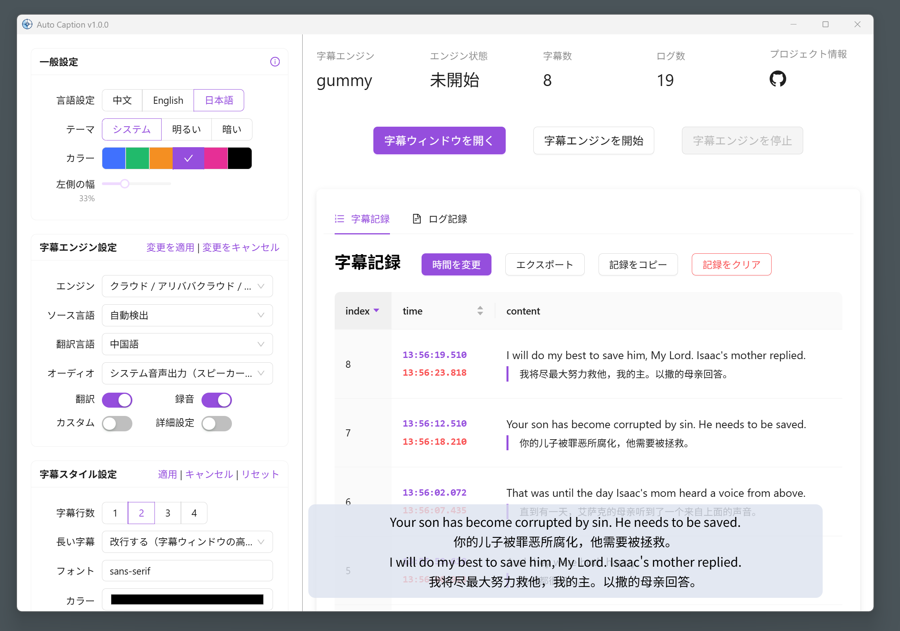

<div align="center" >
    
    <h1 align="center">auto-caption</h1>
    <p>Auto Caption はクロスプラットフォームのリアルタイム字幕表示ソフトウェアです。</p>
    <p>
      <a href="https://github.com/HiMeditator/auto-caption/releases">
        
      </a>
      <a href="https://github.com/HiMeditator/auto-caption/issues">
        
      </a>
      
      
      
    </p>
    <p>
        | <a href="./README.md">简体中文</a>
        | <a href="./README_en.md">English</a>
        | <b>日本語</b> |
    </p>
    <p><i>Voskローカル字幕エンジンを含む v0.4.0 バージョンがリリースされました。<b>現在、ローカル字幕エンジンには翻訳機能が含まれておりません</b>。ローカル翻訳モジュールは現在も開発中です...</i></p>
</div>



## 📥 ダウンロード

[GitHub Releases](https://github.com/HiMeditator/auto-caption/releases)

## 📚 関連ドキュメント

[Auto Caption ユーザーマニュアル](./docs/user-manual/ja.md)

[字幕エンジン説明ドキュメント](./docs/engine-manual/ja.md)

[プロジェクト API ドキュメント（中国語）](./docs/api-docs/electron-ipc.md)

## 📖 基本使い方

現在、Windows と macOS プラットフォーム向けのインストール可能なバージョンを提供しています。

> 阿里雲の国際版サービスでは Gummy モデルを提供していないため、現在中国以外のユーザーは Gummy 字幕エンジンを使用できません。

デフォルトの Gummy 字幕エンジン（クラウドベースのモデルを使用した音声認識と翻訳）を使用するには、まず阿里雲百煉プラットフォームから API KEY を取得する必要があります。その後、API KEY をソフトウェア設定に追加するか、環境変数に設定します（Windows プラットフォームのみ環境変数からの API KEY 読み取りをサポート）。関連チュートリアル：

- [API KEY の取得（中国語）](https://help.aliyun.com/zh/model-studio/get-api-key)
- [環境変数を通じて API Key を設定（中国語）](https://help.aliyun.com/zh/model-studio/configure-api-key-through-environment-variables)

> Vosk モデルの認識精度は低いため、注意してご使用ください。

Vosk ローカル字幕エンジンを使用するには、まず [Vosk Models](https://alphacephei.com/vosk/models) ページから必要なモデルをダウンロードし、ローカルに解凍した後、モデルフォルダのパスをソフトウェア設定に追加してください。現在、Vosk 字幕エンジンは字幕の翻訳をサポートしていません。


**上記の字幕エンジンがご要望を満たさず、かつ Python の知識をお持ちの場合、独自の字幕エンジンを開発することも可能です。詳細な説明は[字幕エンジン説明書](./docs/engine-manual/ja.md)をご参照ください。**

## ✨ 特徴

- クロスプラットフォーム、多言語 UI サポート
- 豊富な字幕スタイル設定
- 柔軟な字幕エンジン選択
- 多言語認識と翻訳
- 字幕記録の表示とエクスポート
- オーディオ出力またはマイク入力からの字幕生成

注記：
- Windows と macOS プラットフォームはオーディオ出力とマイク入力の両方からの字幕生成をサポートしていますが、**macOS プラットフォームでシステムオーディオ出力を取得するには設定が必要です。詳細は[Auto Caption ユーザーマニュアル](./docs/user-manual/ja.md)をご覧ください。**
- Linux プラットフォームは現在システムオーディオ出力を取得できず、マイク入力からの字幕生成のみをサポートしています。

## ⚙️ 字幕エンジン説明

現在ソフトウェアには2つの字幕エンジンが組み込まれており、1つの新しいエンジンを計画中です。詳細は以下の通りです。

### Gummy 字幕エンジン（クラウド）

Tongyi Lab の [Gummy 音声翻訳大規模モデル](https://help.aliyun.com/zh/model-studio/gummy-speech-recognition-translation/)をベースに開発され、[Alibaba Cloud Bailian](https://bailian.console.aliyun.com) の APIを使用してこのクラウドモデルを呼び出します。

**モデル詳細パラメータ：**

- サポートするオーディオサンプルレート：16kHz以上
- オーディオサンプルビット深度：16bit
- サポートするオーディオチャンネル：モノラル
- 認識可能な言語：中国語、英語、日本語、韓国語、ドイツ語、フランス語、ロシア語、イタリア語、スペイン語
- サポートする翻訳：
  - 中国語 → 英語、日本語、韓国語
  - 英語 → 中国語、日本語、韓国語
  - 日本語、韓国語、ドイツ語、フランス語、ロシア語、イタリア語、スペイン語 → 中国語または英語

**ネットワークトラフィック消費量：**

字幕エンジンはネイティブサンプルレート（48kHz と仮定）でサンプリングを行い、サンプルビット深度は 16bit、アップロードオーディオはモノラルチャンネルのため、アップロードレートは約：

$$
48000\ \text{samples/second} \times 2\ \text{bytes/sample} \times 1\ \text{channel}  = 93.75\ \text{KB/s}
$$

また、エンジンはオーディオストームを取得したときのみデータをアップロードするため、実際のアップロードレートはさらに小さくなる可能性があります。モデル結果の返信トラフィック消費量は小さく、ここでは考慮していません。

### Vosk字幕エンジン（ローカル）

[vosk-api](https://github.com/alphacep/vosk-api) をベースに開発されています。現在は音声に対応する原文の生成のみをサポートしており、翻訳コンテンツはサポートしていません。

### FunASR字幕エンジン（ローカル）

可能であれば、[FunASR](https://github.com/modelscope/FunASR) をベースに開発予定です。まだ調査と実現可能性の検証を行っていません。

## 🚀 プロジェクト実行


### 依存関係のインストール

```bash
npm install
```

### 字幕エンジンの構築

まず `caption-engine` フォルダに入り、以下のコマンドを実行して仮想環境を作成します：

```bash
# ./caption-engine フォルダ内
python -m venv subenv
# または
python3 -m venv subenv
```

次に仮想環境をアクティブにします：

```bash
# Windows
subenv/Scripts/activate
# Linux または macOS
source subenv/bin/activate
```

その後、依存関係をインストールします（Linux または macOS 環境の場合、`requirements.txt` 内の `PyAudioWPatch` をコメントアウトする必要があります。このモジュールは Windows 環境専用です）。

> このステップでエラーが発生する場合があります。一般的にはビルド失敗が原因で、エラーメッセージに基づいて対応するビルドツールパッケージをインストールする必要があります。

```bash
pip install -r requirements.txt
```

その後、`pyinstaller` を使用してプロジェクトをビルドします：

```bash
pyinstaller ./main-gummy.spec
pyinstaller ./main-vosk.spec
```

これでプロジェクトのビルドが完了し、`caption-engine/dist` フォルダ内に対応する実行可能ファイルが確認できます。その後、次の操作に進むことができます。

### プロジェクト実行

```bash
npm run dev
```

### プロジェクト構築

現在、ソフトウェアは Windows と macOS プラットフォームでのみ構築とテストが行われており、Linux プラットフォームでの正しい動作は保証できません。

```bash
# Windows 用
npm run build:win
# macOS 用
npm run build:mac
# Linux 用
npm run build:linux
```

注意: プラットフォームに応じて、プロジェクトルートディレクトリにある `electron-builder.yml` ファイルの設定内容を変更する必要があります:

```yml
extraResources:
  # Windows用
  - from: ./caption-engine/dist/main-gummy.exe
    to: ./caption-engine/main-gummy.exe
  - from: ./caption-engine/dist/main-vosk.exe
    to: ./caption-engine/main-vosk.exe
  # macOSとLinux用
  # - from: ./caption-engine/dist/main-gummy
  #   to: ./caption-engine/main-gummy
  # - from: ./caption-engine/dist/main-vosk
  #   to: ./caption-engine/main-vosk
```
