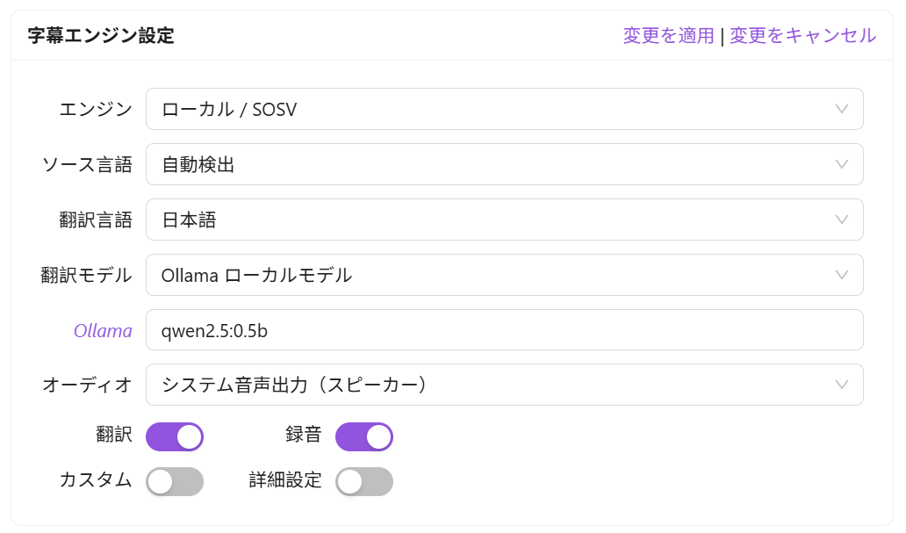
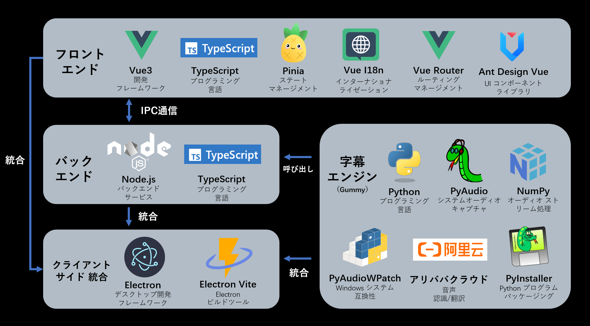

<div align="center" >
    
    <h1 align="center">auto-caption</h1>
    <p>Auto Caption はクロスプラットフォームのリアルタイム字幕表示ソフトウェアです。</p>
    <p>
      <a href="https://github.com/HiMeditator/auto-caption/releases"></a>
      <a href="https://github.com/HiMeditator/auto-caption/issues"></a>
      
      
      
    </p>
    <p>
        | <a href="./README.md">简体中文</a>
        | <a href="./README_en.md">English</a>
        | <b>日本語</b> |
    </p>
    <p><i>v1.0.0 バージョンがリリースされ、SOSV ローカル字幕モデルが追加されました。より多くの字幕モデルが開発中です...</i></p>
</div>


## 📥 ダウンロード

ソフトウェアダウンロード: [GitHub Releases](https://github.com/HiMeditator/auto-caption/releases)

Vosk モデルダウンロード: [Vosk Models](https://alphacephei.com/vosk/models)

SOSV モデルダウンロード: [Shepra-ONNX SenseVoice Model](https://github.com/HiMeditator/auto-caption/releases/tag/sosv-model)

## 📚 関連ドキュメント

[Auto Caption ユーザーマニュアル](./docs/user-manual/ja.md)

[字幕エンジン説明ドキュメント](./docs/engine-manual/ja.md)

[更新履歴](./docs/CHANGELOG.md)

## ✨ 特徴

- 音声出力またはマイク入力からの字幕生成
- ローカルのOllamaモデルまたはクラウドベースのGoogle翻訳APIを呼び出して翻訳をサポート
- クロスプラットフォーム（Windows、macOS、Linux）、多言語インターフェース（中国語、英語、日本語）対応
- 豊富な字幕スタイル設定（フォント、フォントサイズ、フォント太さ、フォント色、背景色など）
- 柔軟な字幕エンジン選択（阿里云Gummyクラウドモデル、ローカルVoskモデル、ローカルSOSVモデル、または独自にモデルを開発可能）
- 多言語認識と翻訳（下記「⚙️ 字幕エンジン説明」参照）
- 字幕記録表示とエクスポート（`.srt` および `.json` 形式のエクスポートに対応）

## 📖 基本使い方

このソフトウェアは Windows、macOS、Linux プラットフォームに対応しています。テスト済みのプラットフォーム情報は以下の通りです：

| OS バージョン | アーキテクチャ | システムオーディオ入力 | システムオーディオ出力 |
| ------------------ | ------------ | ------------------ | ------------------- |
| Windows 11 24H2    | x64          | ✅                 | ✅                   |
| macOS Sequoia 15.5 | arm64        | ✅ [追加設定が必要](./docs/user-manual/ja.md#macos-でのシステムオーディオ出力の取得方法)    | ✅                   |
| Ubuntu 24.04.2     | x64          | ✅                 | ✅                   |
| Kali Linux 2022.3  | x64          | ✅                 | ✅                   |
| Kylin Server V10 SP3 | x64 | ✅ | ✅ |

macOS および Linux プラットフォームでシステムオーディオ出力を取得するには追加設定が必要です。詳細は[Auto Captionユーザーマニュアル](./docs/user-manual/ja.md)をご覧ください。

ソフトウェアをダウンロードした後、自分のニーズに応じて対応するモデルを選択し、モデルを設定する必要があります。

|                                                              | 認識効果 | デプロイタイプ    | 対応言語   | 翻訳       | 備考                                                       |
| ------------------------------------------------------------ | -------- | ----------------- | ---------- | ---------- | ---------------------------------------------------------- |
| [Gummy](https://help.aliyun.com/zh/model-studio/gummy-speech-recognition-translation) | 良好😊    | クラウド / 阿里云 | 10種       | 内蔵翻訳   | 有料、0.54CNY / 時間                                       |
| [Vosk](https://alphacephei.com/vosk)                         | 不良😞    | ローカル / CPU    | 30種以上   | 追加設定必要 | 対応言語が非常に多い                                       |
| [SOSV](https://k2-fsa.github.io/sherpa/onnx/sense-voice/index.html) | 一般😐    | ローカル / CPU    | 5種        | 追加設定必要 | モデルは一つのみ                                           |
| 自前開発                                                     | 🤔        | カスタム          | カスタム   | カスタム   | [ドキュメント](./docs/engine-manual/zh.md)に従ってPythonで自前開発 |

VoskまたはSOSVモデルを使用する場合、独自の翻訳モデルも設定する必要があります。

### 翻訳モデルの設定



> 注意：翻訳はリアルタイムではありません。翻訳モデルは各文の認識が完了した後にのみ呼び出されます。

#### Ollama ローカルモデル

> 注意：パラメータ数が多すぎるモデルを使用すると、リソース消費と翻訳遅延が大きくなります。1B未満のパラメータ数のモデルを使用することを推奨します。例：`qwen2.5:0.5b`、`qwen3:0.6b`。

このモデルを使用する前に、ローカルマシンに[Ollama](https://ollama.com/)ソフトウェアがインストールされ、必要な大規模言語モデルがダウンロードされていることを確認してください。必要な大規模モデル名を設定の`Ollama`フィールドに追加するだけでOKです。

#### Google翻訳API

> 注意：Google翻訳APIは一部の地域では使用できません。

設定不要で、ネット接続があれば使用できます。

### Gummyモデルの使用

> 阿里云の国際版サービスにはGummyモデルが提供されていないため、現在中国以外のユーザーはGummy字幕エンジンを使用できない可能性があります。

デフォルトのGummy字幕エンジン（クラウドモデルを使用した音声認識と翻訳）を使用するには、まず阿里云百煉プラットフォームのAPI KEYを取得し、API KEYをソフトウェア設定に追加するか環境変数に設定する必要があります（Windowsプラットフォームのみ環境変数からのAPI KEY読み取りをサポート）。関連チュートリアル：

- [API KEYの取得](https://help.aliyun.com/zh/model-studio/get-api-key)
- [環境変数へのAPI Keyの設定](https://help.aliyun.com/zh/model-studio/configure-api-key-through-environment-variables)

### Voskモデルの使用

> Voskモデルの認識効果は不良のため、注意して使用してください。

Voskローカル字幕エンジンを使用するには、まず[Vosk Models](https://alphacephei.com/vosk/models)ページから必要なモデルをダウンロードし、ローカルにモデルを解凍し、モデルフォルダのパスをソフトウェア設定に追加してください。


### SOSVモデルの使用

SOSVモデルの使用方法はVoskと同じで、ダウンロードアドレスは以下の通りです：https://github.com/HiMeditator/auto-caption/releases/tag/sosv-model

## ⚙️ 字幕エンジン説明

現在、ソフトウェアには3つの字幕エンジンが搭載されており、新しいエンジンが計画されています。それらの詳細情報は以下の通りです。

### Gummy 字幕エンジン（クラウド）

Tongyi Lab の [Gummy 音声翻訳大規模モデル](https://help.aliyun.com/zh/model-studio/gummy-speech-recognition-translation/)をベースに開発され、[Alibaba Cloud Bailian](https://bailian.console.aliyun.com) の APIを使用してこのクラウドモデルを呼び出します。

**モデル詳細パラメータ：**

- サポートするオーディオサンプルレート：16kHz以上
- オーディオサンプルビット深度：16bit
- サポートするオーディオチャンネル：モノラル
- 認識可能な言語：中国語、英語、日本語、韓国語、ドイツ語、フランス語、ロシア語、イタリア語、スペイン語
- サポートする翻訳：
  - 中国語 → 英語、日本語、韓国語
  - 英語 → 中国語、日本語、韓国語
  - 日本語、韓国語、ドイツ語、フランス語、ロシア語、イタリア語、スペイン語 → 中国語または英語

**ネットワークトラフィック消費量：**

字幕エンジンはネイティブサンプルレート（48kHz と仮定）でサンプリングを行い、サンプルビット深度は 16bit、アップロードオーディオはモノラルチャンネルのため、アップロードレートは約：

$$
48000\ \text{samples/second} \times 2\ \text{bytes/sample} \times 1\ \text{channel}  = 93.75\ \text{KB/s}
$$

また、エンジンはオーディオストームを取得したときのみデータをアップロードするため、実際のアップロードレートはさらに小さくなる可能性があります。モデル結果の返信トラフィック消費量は小さく、ここでは考慮していません。

### Vosk字幕エンジン（ローカル）

[vosk-api](https://github.com/alphacep/vosk-api)をベースに開発。この字幕エンジンの利点は選択可能な言語モデルが非常に多く（30言語以上）、欠点は認識効果が比較的悪く、生成内容に句読点がないことです。

### SOSV 字幕エンジン（ローカル）

[SOSV](https://github.com/HiMeditator/auto-caption/releases/tag/sosv-model)は統合パッケージで、主に[Shepra-ONNX SenseVoice](https://k2-fsa.github.io/sherpa/onnx/sense-voice/index.html)をベースにし、エンドポイント検出モデルと句読点復元モデルを追加しています。このモデルが認識をサポートする言語は：英語、中国語、日本語、韓国語、広東語です。

### 新規計画字幕エンジン

以下は候補モデルであり、モデルの性能と統合の容易さに基づいて選択されます。

- [faster-whisper](https://github.com/SYSTRAN/faster-whisper)
- [sherpa-onnx](https://github.com/k2-fsa/sherpa-onnx)
- [SenseVoice](https://github.com/FunAudioLLM/SenseVoice)
- [FunASR](https://github.com/modelscope/FunASR)
- [WhisperLiveKit](https://github.com/QuentinFuxa/WhisperLiveKit)

## 🚀 プロジェクト実行



### 依存関係のインストール

```bash
npm install
```

### 字幕エンジンの構築

まず `engine` フォルダに入り、以下のコマンドを実行して仮想環境を作成します（Python 3.10 以上が必要で、Python 3.12 が推奨されます）：

```bash
cd ./engine
# ./engine フォルダ内
python -m venv .venv
# または
python3 -m venv .venv
```

次に仮想環境をアクティブにします：

```bash
# Windows
.venv/Scripts/activate
# Linux または macOS
source .venv/bin/activate
```

次に依存関係をインストールします（このステップでは macOS と Linux でエラーが発生する可能性があります。通常はビルド失敗によるもので、エラーメッセージに基づいて対処する必要があります）：

```bash
pip install -r requirements.txt
```

その後、`pyinstaller` を使用してプロジェクトをビルドします：

```bash
pyinstaller ./main.spec
```

`main-vosk.spec` ファイル内の `vosk` ライブラリのパスが正しくない可能性があるため、実際の状況（Python 環境のバージョンに関連）に応じて設定する必要があります。

```
# Windows
vosk_path = str(Path('./.venv/Lib/site-packages/vosk').resolve())
# Linux または macOS
vosk_path = str(Path('./.venv/lib/python3.x/site-packages/vosk').resolve())
```

これでプロジェクトのビルドが完了し、`engine/dist` フォルダ内に対応する実行可能ファイルが確認できます。その後、次の操作に進むことができます。

### プロジェクト実行

```bash
npm run dev
```

### プロジェクト構築

```bash
# Windows 用
npm run build:win
# macOS 用
npm run build:mac
# Linux 用
npm run build:linux
```
