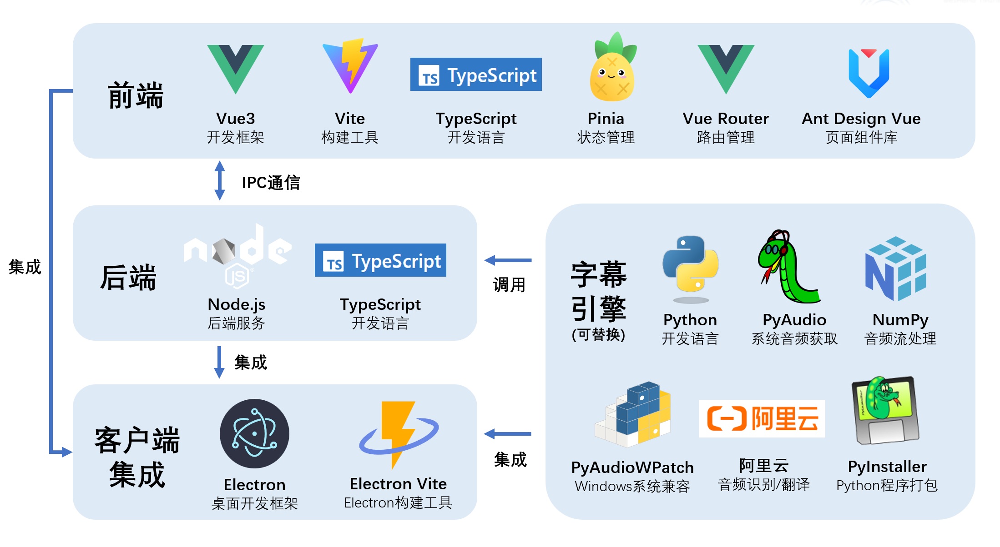

# 字幕引擎说明文档



## 字幕引擎介绍

所谓的字幕引擎实际上是一个子程序，它会实时获取系统音频输入（录音）或输出（播放声音）的流式数据，并调用音频转文字的模型生成对应音频的字幕。生成的字幕通过 IPC 输出为转换为字符串的 JSON 数据，并返回给主程序。主程序读取字幕数据，处理后显示在窗口上。

## 字幕引擎需要实现的功能

### 音频获取

首先，你的字幕引擎需要获取系统音频输入（录音）或输出（播放声音）的流式数据。如果使用 Python 开发，可以使用 PyAudio 模块获取麦克风音频输入数据（全平台通用）。使用 PyAudioWPatch 模块获取音频音频输出（仅适用于 Windows 平台）。

一般获取的音频流数据实际上是一个个时间比较短的音频块，需要根据模型调整音频块的大小。比如阿里云的Gummy 模型使用 0.05 秒大小的音频块识别效果优于使用 0.2 秒大小的音频块。

### 音频处理

获取到的音频流在转文字之前可能需要进行预处理。比如阿里云的Gummy模型只能识别单通道的音频流，而收集的音频流一般是双通道的，因此要将双通道音频流转换为单通道。

### 音频转文字

在得到了合适的音频流后，就可以将音频流转换为文字了。一般使用各种模型来实现音频流转文字。可根据需求自行选择模型。

### 数据传递

在获取到当前音频流的文字后，需要将文字传递给主程序。使用进程间通信(IPC)的方式，比如通过标准输入输出流或者命名管道来实现。传递的内容必须是 JSON 字符串，其中 JSON 对象需要包含的参数如下：

```typescript
export interface CaptionItem {
  index: number, // 字幕序号
  time_s: string, // 当前字幕开始时间
  time_t: string, // 当前字幕结束时间
  text: string, // 字幕内容
  translation: string // 字幕翻译
}
```

如果使用 python 语言，可以参考以下方式将数据传递给主程序。

```python
# python-subprocess\audio2text\gummy.py
...
    def send_to_node(self, data):
        """
        将数据发送到 Node.js 进程
        """
        try:
            json_data = json.dumps(data) + '\n'
            sys.stdout.write(json_data)
            sys.stdout.flush()
        except Exception as e:
            print(f"Error sending data to Node.js: {e}", file=sys.stderr)
...
```

数据接收端代码如下：


```typescript
// src\main\utils\engine.ts
...
    this.process.stdout.on('data', (data) => {
      const lines = data.toString().split('\n');
      lines.forEach((line: string) => {
        if (line.trim()) {
          try {
            const caption = JSON.parse(line);
            addCaptionLog(caption);
          } catch (e) {
            controlWindow.sendErrorMessage('字幕引擎输出内容无法解析为 JSON 对象：' + e)
            console.error('[ERROR] Error parsing JSON:', e);
          }
        }
      });
    });

    this.process.stderr.on('data', (data) => {
      controlWindow.sendErrorMessage('字幕引擎错误：' + data)
      console.error(`[ERROR] Subprocess Error: ${data}`);
    });
...
```

## 参考代码

本项目 `python-subprocess` 文件夹下的 `main-gummy.py` 文件为默认字幕引擎的入口代码。`src\main\utils\engine.ts` 为服务端获取字幕引擎数据和进行处理的代码。可以根据需要阅读了解字幕引擎的实现细节和完整运行原过程。