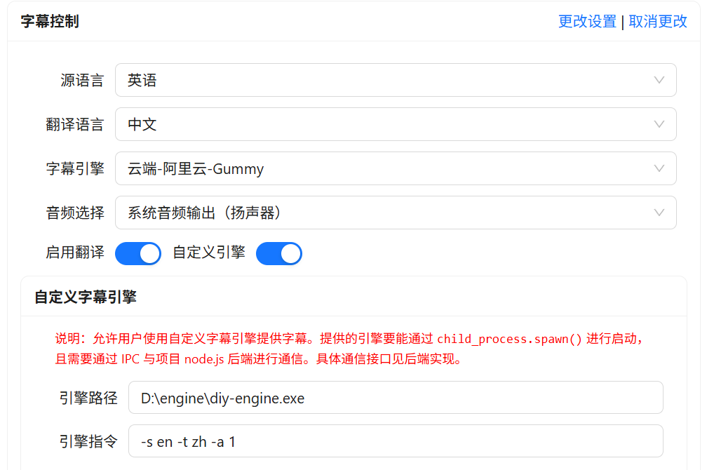

# Auto Caption 用户手册

## 软件简介

Auto Caption 是一个跨平台的字幕显示软件，能够实时获取系统音频输入（录音）或输出（播放声音）的流式数据，并调用音频转文字的模型生成对应音频的字幕。软件提供的默认字幕引擎（使用阿里云Gummy模型）支持九种语言（中英日韩德法俄西意）的识别与翻译。

目前软件默认字幕引擎只有在 Windows 平台下才拥有完整功能。在 Linux 平台下只能生成音频输入（麦克风）的字幕，暂不支持音频输出（播放声音）的字幕生成。

### 软件缺点

要使用默认字幕服务需要获取阿里云的 API KEY。

软件使用 Electron 构建，因此软件体积不可避免的较大。

## 软件使用

### 准备阿里云百炼平台 API KEY

要使用软件提供的默认字幕引擎（阿里云Gummy），需要从阿里云百炼平台获取 API KEY 并在本机环境变量中配置。

这部分阿里云提供了详细的教程，可参考：

- [获取API KEY](https://help.aliyun.com/zh/model-studio/get-api-key)

- [将API Key配置到环境变量](https://help.aliyun.com/zh/model-studio/configure-api-key-through-environment-variables)。

### 修改字幕设置

字幕设置可以分为两类：修改字幕引擎配置、修改字幕样式设置。需要注意的是在调整的设置的参数后，需要点击配置分类右上角的“更改设置”（字幕引擎设置）或“应用样式”（字幕样式设置），更改才会真正生效。如果点击“取消更改”那么当前设置将不会被保存，而是回到上次修改的状态。

### 启动和关闭字幕

在修改完全部配置后，点击界面的“启动字幕引擎”按钮，即可启动字幕。如果需要独立的字幕展示窗口，单击界面的“打开字幕窗口”按钮即可激活独立的字幕展示窗口。如果需要暂停字幕识别，单击界面的“关闭字幕引擎”按钮即可。

### 调整字幕展示窗口

如下图为字幕展示窗口，该窗口实时展示当前最新字幕。窗口右上角三个按钮的功能分别是：将窗口固定在最前面、打开字幕控制窗口、关闭字幕展示窗口。该窗口宽度可以调整，将鼠标移动至窗口的左右边缘，拖动鼠标即可调整宽度。

### 字幕记录的导出

在字幕控制窗口中可以看到当前收集的所有字幕的记录，点击“导出字幕记录”按钮，即可将字幕记录导出为 JSON 文件。

## 字幕引擎

所谓的字幕引擎实际上是一个子程序，它会实时获取系统音频输入（录音）或输出（播放声音）的流式数据，并调用音频转文字的模型生成对应音频的字幕。生成的字幕通过 IPC 输出为转换为字符串的 JSON 数据，并返回给主程序。主程序读取字幕数据，处理后显示在窗口上。

软件提供的一个默认的字幕引擎，如果你需要其他的字幕引擎，可以通过打开自定义引擎选项来调用其他字幕引擎。其中引擎路径是自定义字幕引擎在你的电脑上的路径，引擎指令是自定义字幕引擎的运行参数，这部分需要按该字幕引擎的规则进行填写。

注意使用自定义字幕引擎时，前面的字幕引擎的设置将全部不起作用，字幕引擎的配置完全通过引擎指令进行配置。

如果你是开发者，想开发自定义字幕引擎，请查看[字幕引擎说明文档](./engine-manual_zh.md)。