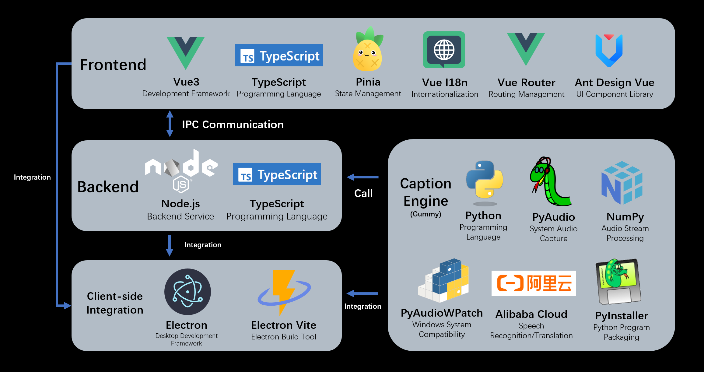

# Caption Engine Documentation

Corresponding version: v1.0.0



## Introduction to the Caption Engine

The so-called caption engine is actually a subprocess that captures streaming data from system audio input (microphone) or output (speaker) in real-time, and invokes an audio-to-text model to generate captions for the corresponding audio. The generated captions are converted into JSON-formatted string data and transmitted to the main program through standard output (ensuring that the string received by the main program can be correctly interpreted as a JSON object). The main program reads and interprets the caption data, processes it, and displays it in the window.

**Communication between the caption engine process and Electron main process follows the standard: [caption engine api-doc](../api-docs/caption-engine.md).**

## Execution Flow

Process of communication between main process and caption engine:

### Starting the Engine

- Electron main process: Use `child_process.spawn()` to start the caption engine process
- Caption engine process: Create a TCP Socket server thread, after creation output a JSON object converted to string via standard output, containing the `command` field with value `connect`
- Main process: Listen to the caption engine process's standard output, try to split the standard output by lines, parse it into a JSON object, and check if the object's `command` field value is `connect`. If so, connect to the TCP Socket server

### Caption Recognition

- Caption engine process: Create a new thread to monitor system audio output, put acquired audio data chunks into a shared queue (`shared_data.chunk_queue`). The caption engine continuously reads audio data chunks from the shared queue and parses them. The caption engine may also create a new thread to perform translation operations. Finally, the caption engine sends parsed caption data object strings through standard output
- Electron main process: Continuously listen to the caption engine's standard output and take different actions based on the parsed object's `command` field

### Stopping the Engine

- Electron main process: When the user operates to close the caption engine in the frontend, the main process sends an object string with `command` field set to `stop` to the caption engine process through Socket communication
- Caption engine process: Receive the caption data object string sent by the main engine process, parse the string into an object. If the object's `command` field is `stop`, set the value of global variable `shared_data.status` to `stop`
- Caption engine process: Main thread continuously monitors system audio output, when `thread_data.status` value is not `running`, end the loop, release resources, and terminate execution
- Electron main process: If the caption engine process termination is detected, perform corresponding processing and provide feedback to the frontend

## Implemented Features

The following features have been implemented and can be directly reused.

### Standard Output

Can output regular information, commands, and error messages.

Examples:

```python
from utils import stdout, stdout_cmd, stdout_obj, stderr
# {"command": "print", "content": "Hello"}\n
stdout("Hello")
# {"command": "connect", "content": "8080"}\n
stdout_cmd("connect", "8080")
# {"command": "print", "content": "print"}\n
stdout_obj({"command": "print", "content": "print"})
# sys.stderr.write("Error Info" + "\n")
stderr("Error Info")
```

### Creating Socket Service

This Socket service listens on a specified port, parses content sent by the Electron main program, and may change the value of `shared_data.status`.

Example:

```python
from utils import start_server
from utils import shared_data
port = 8080
start_server(port)
while thread_data == 'running':
    # do something
    pass
```

### Audio Acquisition

The `AudioStream` class is used to acquire audio data, with cross-platform implementation supporting Windows, Linux, and macOS. The class initialization includes two parameters:

- `audio_type`: Audio acquisition type, 0 for system output audio (speaker), 1 for system input audio (microphone)
- `chunk_rate`: Audio data acquisition frequency, number of audio chunks acquired per second, default is 10

The class contains four methods:

- `open_stream()`: Start audio acquisition
- `read_chunk() -> bytes`: Read an audio chunk
- `close_stream()`: Close audio acquisition
- `close_stream_signal()`: Thread-safe closing of system audio input stream

Example:

```python
from sysaudio import AudioStream
audio_type = 0
chunk_rate = 20
stream =  AudioStream(audio_type, chunk_rate)
stream.open_stream()
while True:
    data = stream.read_chunk()
    # do something with data
    pass
stream.close_stream()
```

### Audio Processing

Before converting audio streams to text, preprocessing may be required. Usually, multi-channel audio needs to be converted to single-channel audio, and resampling may also be needed. This project provides two audio processing functions:

- `merge_chunk_channels(chunk: bytes, channels: int) -> bytes`: Convert multi-channel audio chunks to single-channel audio chunks
- `resample_chunk_mono(chunk: bytes, channels: int, orig_sr: int, target_sr: int) -> bytes`: Convert current multi-channel audio data chunks to single-channel audio data chunks, then perform resampling

Example:

```python
from sysaudio import AudioStream
from utils import merge_chunk_channels
stream =  AudioStream(1)
while True:
    raw_chunk = stream.read_chunk()
    chunk = resample_chunk_mono(raw_chunk, stream.CHANNELS, stream.RATE, 16000)
    # do something with chunk
```

## Features to be Implemented by the Caption Engine

### Audio to Text Conversion

After obtaining suitable audio streams, the audio stream needs to be converted to text. Generally, various models (cloud or local) are used to implement audio-to-text conversion. Appropriate models should be selected according to requirements.

It is recommended to encapsulate this as a class, implementing four methods:

- `start(self)`: Start the model
- `send_audio_frame(self, data: bytes)`: Process current audio chunk data, **generated caption data is sent to Electron main process through standard output**
- `translate(self)`: Continuously retrieve data chunks from `shared_data.chunk_queue` and call `send_audio_frame` method to process data chunks
- `stop(self)`: Stop the model

Complete caption engine examples:

- [gummy.py](../../engine/audio2text/gummy.py)
- [vosk.py](../../engine/audio2text/vosk.py)
- [sosv.py](../../engine/audio2text/sosv.py)

### Caption Translation

Some speech-to-text models do not provide translation. If needed, an additional translation module needs to be added, or built-in translation modules can be used.

Example:

```python
from utils import google_translate, ollama_translate
text = "This is a translation test."
google_translate("", "en", text, "time_s")
ollama_translate("qwen3:0.6b", "en", text, "time_s")
```

### Caption Data Transmission

After obtaining the text from the current audio stream, the text needs to be sent to the main program. The caption engine process transmits caption data to the Electron main process through standard output.

The transmitted content must be a JSON string, where the JSON object needs to contain the following parameters:

```typescript
export interface CaptionItem {
  command: "caption",
  index: number,        // Caption sequence number
  time_s: string,       // Current caption start time
  time_t: string,       // Current caption end time
  text: string,         // Caption content
  translation: string   // Caption translation
}
```

**Note that the buffer must be flushed after each caption JSON data output to ensure that the Electron main process receives strings that can be interpreted as JSON objects each time.** It is recommended to use the project's existing `stdout_obj` function for transmission.

### Command Line Parameter Specification

Custom caption engine settings provide command line parameter specification, so the caption engine parameters need to be set properly. Currently used parameters in this project are as follows:

```python
if __name__ == "__main__":
    parser = argparse.ArgumentParser(description='Convert system audio stream to text')
    # all
    parser.add_argument('-e', '--caption_engine', default='gummy', help='Caption engine: gummy or vosk')
    parser.add_argument('-a', '--audio_type', default=0, help='Audio stream source: 0 for output, 1 for input')
    parser.add_argument('-c', '--chunk_rate', default=10, help='Number of audio stream chunks collected per second')
    parser.add_argument('-p', '--port', default=0, help='The port to run the server on, 0 for no server')
    parser.add_argument('-t', '--target_language', default='zh', help='Target language code, "none" for no translation')
    parser.add_argument('-r', '--record', default=0, help='Whether to record the audio, 0 for no recording, 1 for recording')
    parser.add_argument('-rp', '--record_path', default='', help='Path to save the recorded audio')
    # gummy and sosv
    parser.add_argument('-s', '--source_language', default='auto', help='Source language code')
    # gummy only
    parser.add_argument('-k', '--api_key', default='', help='API KEY for Gummy model')
    # vosk and sosv
    parser.add_argument('-tm', '--translation_model', default='ollama', help='Model for translation: ollama or google')
    parser.add_argument('-omn', '--ollama_name', default='', help='Ollama model name for translation')
    # vosk only
    parser.add_argument('-vosk', '--vosk_model', default='', help='The path to the vosk model.')
    # sosv only
    parser.add_argument('-sosv', '--sosv_model', default=None, help='The SenseVoice model path')
```

For example, for this project's caption engine, if I want to use the Gummy model, specify the original text as Japanese, translate to Chinese, and capture captions from system audio output, with 0.1s audio data segments each time, the command line parameters would be:

```bash
python main.py -e gummy -s ja -t zh -a 0 -c 10 -k <dashscope-api-key>
```

## Additional Notes  

### Communication Standards  

[caption engine api-doc](../api-docs/caption-engine.md)  

### Program Entry  

[main.py](../../engine/main.py)  

### Development Recommendations  

Except for audio-to-text conversion and translation, other components (audio acquisition, audio resampling, and communication with the main process) are recommended to directly reuse the project's code. If this approach is taken, the content that needs to be added includes:

- `engine/audio2text/`: Add a new audio-to-text class (file-level).  
- `engine/main.py`: Add new parameter settings and workflow functions (refer to `main_gummy` and `main_vosk` functions).  

### Packaging  

After development and testing, the caption engine must be packaged into an executable. Typically, `pyinstaller` is used. If the packaged executable reports errors, check for missing dependencies.  

### Execution  

With a functional caption engine, it can be launched in the caption software window by specifying the engine's path and runtime arguments.  

  