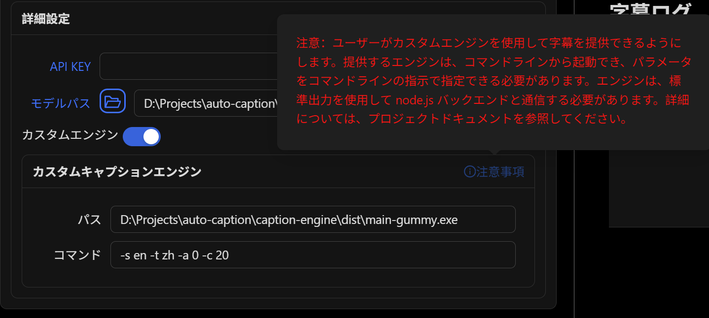

# 字幕エンジン説明ドキュメント

対応バージョン：v0.6.0

この文書は大規模モデルを使用して翻訳されていますので、内容に正確でない部分があるかもしれません。


## 字幕エンジン紹介

字幕エンジンとは、システムのオーディオ入力（マイク）または出力（スピーカー）のストリーミングデータをリアルタイムで取得し、音声を文字に変換するモデルを呼び出して対応する字幕を生成するサブプログラムです。生成された字幕はJSON形式の文字列データに変換され、標準出力を介してメインプログラムに渡されます（メインプログラムが受け取る文字列が正しくJSONオブジェクトとして解釈できる必要があります）。メインプログラムは字幕データを読み取り、解釈して処理した後、ウィンドウに表示します。

**字幕エンジンプロセスとElectronメインプロセス間の通信は、[caption engine api-doc](../api-docs/caption-engine.md)に準拠しています。**

## 実行フロー

メインプロセスと字幕エンジンの通信フロー：

### エンジンの起動

- メインプロセス：`child_process.spawn()`を使用して字幕エンジンプロセスを起動
- 字幕エンジンプロセス：TCP Socketサーバースレッドを作成し、作成後に標準出力にJSONオブジェクトを文字列化して出力。このオブジェクトには`command`フィールドが含まれ、値は`connect`
- メインプロセス：字幕エンジンプロセスの標準出力を監視し、標準出力を行ごとに分割してJSONオブジェクトとして解析し、オブジェクトの`command`フィールドの値が`connect`かどうかを判断。`connect`の場合はTCP Socketサーバーに接続

### 字幕認識

- 字幕エンジンプロセス：メインスレッドでシステムオーディオ出力を監視し、オーディオデータブロックを字幕エンジンに送信して解析。字幕エンジンはオーディオデータブロックを解析し、標準出力を介して解析された字幕データオブジェクト文字列を送信
- メインプロセス：字幕エンジンの標準出力を引き続き監視し、解析されたオブジェクトの`command`フィールドに基づいて異なる操作を実行

### エンジンの停止

- メインプロセス：ユーザーがフロントエンドで字幕エンジンを停止する操作を実行すると、メインプロセスはSocket通信を介して字幕エンジンプロセスに`command`フィールドが`stop`のオブジェクト文字列を送信
- 字幕エンジンプロセス：メインエンジンプロセスから送信された字幕データオブジェクト文字列を受信し、文字列をオブジェクトとして解析。オブジェクトの`command`フィールドが`stop`の場合、グローバル変数`thread_data.status`の値を`stop`に設定
- 字幕エンジンプロセス：メインスレッドでシステムオーディオ出力をループ監視し、`thread_data.status`の値が`running`でない場合、ループを終了し、リソースを解放して実行を終了
- メインプロセス：字幕エンジンプロセスの終了を検出した場合、対応する処理を実行し、フロントエンドにフィードバック

## プロジェクトで実装済みの機能

以下の機能はすでに実装されており、直接再利用できます。

### 標準出力

通常情報、コマンド、エラー情報を出力できます。

サンプル：

```python
from utils import stdout, stdout_cmd, stdout_obj, stderr
stdout("Hello") # {"command": "print", "content": "Hello"}\n
stdout_cmd("connect", "8080") # {"command": "connect", "content": "8080"}\n
stdout_obj({"command": "print", "content": "Hello"})
stderr("Error Info")
```

### Socketサービスの作成

このSocketサービスは指定されたポートを監視し、Electronメインプログラムから送信された内容を解析し、`thread_data.status`の値を変更する可能性があります。

サンプル：

```python
from utils import start_server
from utils import thread_data
port = 8080
start_server(port)
while thread_data == 'running':
    # 何か処理
    pass
```

### オーディオ取得

`AudioStream`クラスはオーディオデータを取得するために使用され、Windows、Linux、macOSでクロスプラットフォームで実装されています。このクラスの初期化には2つのパラメータが含まれます：

- `audio_type`：取得するオーディオのタイプ。0はシステム出力オーディオ（スピーカー）、1はシステム入力オーディオ（マイク）
- `chunk_rate`：オーディオデータの取得頻度。1秒あたりに取得するオーディオブロックの数

このクラスには3つのメソッドがあります：

- `open_stream()`：オーディオ取得を開始
- `read_chunk() -> bytes`：1つのオーディオブロックを読み取り
- `close_stream()`：オーディオ取得を閉じる

サンプル：

```python
from sysaudio import AudioStream
audio_type = 0
chunk_rate = 20
stream =  AudioStream(audio_type, chunk_rate)
stream.open_stream()
while True:
    data = stream.read_chunk()
    # データで何か処理
    pass
stream.close_stream()
```

### オーディオ処理

取得したオーディオストリームは、文字に変換する前に前処理が必要な場合があります。一般的に、マルチチャンネルオーディオをシングルチャンネルオーディオに変換し、リサンプリングが必要な場合もあります。このプロジェクトでは、3つのオーディオ処理関数を提供しています：

- `merge_chunk_channels(chunk: bytes, channels: int) -> bytes`：マルチチャンネルオーディオブロックをシングルチャンネルオーディオブロックに変換
- `resample_chunk_mono(chunk: bytes, channels: int, orig_sr: int, target_sr: int, mode="sinc_best") -> bytes`：現在のマルチチャンネルオーディオデータブロックをシングルチャンネルオーディオデータブロックに変換し、リサンプリングを実行
- `resample_mono_chunk(chunk: bytes, orig_sr: int, target_sr: int, mode="sinc_best") -> bytes`：現在のシングルチャンネルオーディオブロックをリサンプリング

## 字幕エンジンで実装が必要な機能

### オーディオから文字への変換

適切なオーディオストリームを取得した後、オーディオストリームを文字に変換する必要があります。一般的に、さまざまなモデル（クラウドまたはローカル）を使用してオーディオストリームを文字に変換します。要件に応じて適切なモデルを選択する必要があります。

この部分はクラスとしてカプセル化することをお勧めします。以下の3つのメソッドを実装する必要があります：

- `start(self)`：モデルを起動
- `send_audio_frame(self, data: bytes)`：現在のオーディオブロックデータを処理し、**生成された字幕データを標準出力を介してElectronメインプロセスに送信**
- `stop(self)`：モデルを停止

完全な字幕エンジンの実例：

- [gummy.py](../../engine/audio2text/gummy.py)
- [vosk.py](../../engine/audio2text/vosk.py)

### 字幕翻訳

一部の音声文字変換モデルは翻訳を提供していません。必要がある場合、翻訳モジュールを追加する必要があります。

### 字幕データの送信

現在のオーディオストリームのテキストを取得した後、そのテキストをメインプログラムに送信する必要があります。字幕エンジンプロセスは標準出力を介して字幕データをElectronメインプロセスに渡します。

送信する内容はJSON文字列でなければなりません。JSONオブジェクトには以下のパラメータを含める必要があります：

```typescript
export interface CaptionItem {
  command: "caption",
  index: number, // 字幕のシーケンス番号
  time_s: string, // 現在の字幕の開始時間
  time_t: string, // 現在の字幕の終了時間
  text: string, // 字幕の内容
  translation: string // 字幕の翻訳
}
```

**JSONデータを出力するたびにバッファをフラッシュし、electronメインプロセスが受信する文字列が常にJSONオブジェクトとして解釈できるようにする必要があります。**

プロジェクトで既に実装されている`stdout_obj`関数を使用して送信することをお勧めします。

### コマンドラインパラメータの指定

カスタム字幕エンジンの設定はコマンドラインパラメータで指定するため、字幕エンジンのパラメータを設定する必要があります。このプロジェクトで現在使用されているパラメータは以下のとおりです：

```python
import argparse
if __name__ == "__main__":
    parser = argparse.ArgumentParser(description='システムオーディオストリームをテキストに変換')
    # 共通
    parser.add_argument('-e', '--caption_engine', default='gummy', help='字幕エンジン: gummyまたはvosk')
    parser.add_argument('-a', '--audio_type', default=0, help='オーディオストリームソース: 0は出力、1は入力')
    parser.add_argument('-c', '--chunk_rate', default=10, help='1秒あたりに収集するオーディオストリームブロックの数')
    parser.add_argument('-p', '--port', default=8080, help='サーバーを実行するポート、0はサーバーなし')
    # gummy専用
    parser.add_argument('-s', '--source_language', default='en', help='ソース言語コード')
    parser.add_argument('-t', '--target_language', default='zh', help='ターゲット言語コード')
    parser.add_argument('-k', '--api_key', default='', help='GummyモデルのAPI KEY')
    # vosk専用
    parser.add_argument('-m', '--model_path', default='', help='voskモデルのパス')
```

たとえば、このプロジェクトの字幕エンジンでGummyモデルを使用し、原文を日本語、翻訳を中国語に指定し、システムオーディオ出力の字幕を取得し、毎回0.1秒のオーディオデータをキャプチャする場合、コマンドラインパラメータは以下のようになります：

```bash
python main.py -e gummy -s ja -t zh -a 0 -c 10 -k <dashscope-api-key>
```

## その他

### 通信規格

[caption engine api-doc](../api-docs/caption-engine.md)

### プログラムエントリ

[main.py](../../engine/main.py)

### 開発の推奨事項

オーディオから文字への変換以外は、このプロジェクトのコードを直接再利用することをお勧めします。その場合、追加する必要がある内容は：

- `engine/audio2text/`：新しいオーディオから文字への変換クラスを追加（ファイルレベル）
- `engine/main.py`：新しいパラメータ設定とプロセス関数を追加（`main_gummy`関数と`main_vosk`関数を参照）

### パッケージ化

字幕エンジンの開発とテストが完了した後、字幕エンジンを実行可能ファイルにパッケージ化する必要があります。一般的に`pyinstaller`を使用してパッケージ化します。パッケージ化された字幕エンジンファイルの実行でエラーが発生した場合、依存ライブラリが不足している可能性があります。不足している依存ライブラリを確認してください。

### 実行

使用可能な字幕エンジンを取得したら、字幕ソフトウェアウィンドウで字幕エンジンのパスと字幕エンジンの実行コマンド（パラメータ）を指定して字幕エンジンを起動できます。

