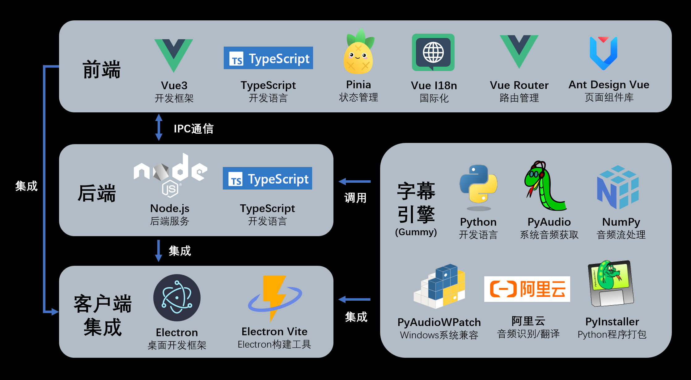
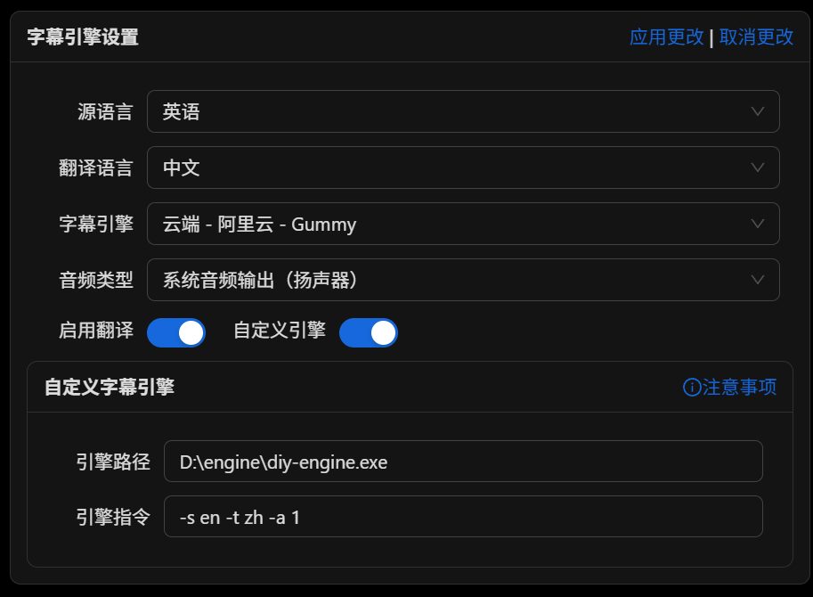

# 字幕引擎说明文档

对应版本：v0.5.0



## 字幕引擎介绍

所谓的字幕引擎实际上是一个子程序，它会实时获取系统音频输入（录音）或输出（播放声音）的流式数据，并调用音频转文字的模型生成对应音频的字幕。生成的字幕转换为 JSON 格式的字符串数据，并通过标准输出传递给主程序（需要保证主程序读取到的字符串可以被正确解释为 JSON 对象）。主程序读取并解释字幕数据，处理后显示在窗口上。

## 字幕引擎需要实现的功能

### 音频获取

首先，你的字幕引擎需要获取系统音频输入（录音）或输出（播放声音）的流式数据。如果使用 Python 开发，可以使用 PyAudio 库获取麦克风音频输入数据（全平台通用）。使用 PyAudioWPatch 库获取系统音频输出（仅适用于 Windows 平台）。

一般获取的音频流数据实际上是一个一个的时间比较短的音频块，需要根据模型调整音频块的大小。比如阿里云的 Gummy 模型使用 0.05 秒大小的音频块识别效果优于使用 0.2 秒大小的音频块。

### 音频处理

获取到的音频流在转文字之前可能需要进行预处理。比如阿里云的 Gummy 模型只能识别单通道的音频流，而收集的音频流一般是双通道的，因此要将双通道音频流转换为单通道。通道数的转换可以使用 NumPy 库中的方法实现。

你可以直接使用我开发好的音频获取（`caption-engine/sysaudio`）和音频处理（`caption-engine/audioprcs`）模块。

### 音频转文字

在得到了合适的音频流后，就可以将音频流转换为文字了。一般使用各种模型来实现音频流转文字。可根据需求自行选择模型。

一个接近完整的字幕引擎实例如下：

```python
import sys
import argparse

# 引入系统音频获取类
if sys.platform == 'win32':
    from sysaudio.win import AudioStream
elif sys.platform == 'darwin':
    from sysaudio.darwin import AudioStream
elif sys.platform == 'linux':
    from sysaudio.linux import AudioStream
else:
    raise NotImplementedError(f"Unsupported platform: {sys.platform}")

# 引入音频处理函数
from audioprcs import mergeChunkChannels
# 引入音频转文本模块
from audio2text import InvalidParameter, GummyTranslator


def convert_audio_to_text(s_lang, t_lang, audio_type, chunk_rate, api_key):
    # 设置标准输出为行缓冲
    sys.stdout.reconfigure(line_buffering=True) # type: ignore

    # 创建音频获取和语音转文字实例
    stream = AudioStream(audio_type, chunk_rate)
    if t_lang == 'none':
        gummy = GummyTranslator(stream.RATE, s_lang, None, api_key)
    else:
        gummy = GummyTranslator(stream.RATE, s_lang, t_lang, api_key)

    # 启动实例
    stream.openStream()
    gummy.start()

    while True:
        try:
            # 读取音频流数据
            chunk = stream.read_chunk()
            chunk_mono = mergeChunkChannels(chunk, stream.CHANNELS)
            try:
                # 调用模型进行翻译
                gummy.send_audio_frame(chunk_mono)
            except InvalidParameter:
                gummy.start()
                gummy.send_audio_frame(chunk_mono)
        except KeyboardInterrupt:
            stream.closeStream()
            gummy.stop()
            break
```

### 字幕翻译

有的语音转文字模型并不提供翻译，需要再添加一个翻译模块。这部分可以使用云端翻译 API 也可以使用本地翻译模型。

### 数据传递

在获取到当前音频流的文字后，需要将文字传递给主程序。字幕引擎进程通过标准输出将字幕数据传递给 electron 主进程。

传递的内容必须是 JSON 字符串，其中 JSON 对象需要包含的参数如下：

```typescript
export interface CaptionItem {
  index: number, // 字幕序号
  time_s: string, // 当前字幕开始时间
  time_t: string, // 当前字幕结束时间
  text: string, // 字幕内容
  translation: string // 字幕翻译
}
```

**注意必须确保每输出一次字幕 JSON 数据就得刷新缓冲区，确保 electron 主进程每次接收到的字符串都可以被解释为 JSON 对象。**

如果使用 python 语言，可以参考以下方式将数据传递给主程序：

```python
# caption-engine\main-gummy.py
sys.stdout.reconfigure(line_buffering=True)

# caption-engine\audio2text\gummy.py
...
    def send_to_node(self, data):
        """
        将数据发送到 Node.js 进程
        """
        try:
            json_data = json.dumps(data) + '\n'
            sys.stdout.write(json_data)
            sys.stdout.flush()
        except Exception as e:
            print(f"Error sending data to Node.js: {e}", file=sys.stderr)
...
```

数据接收端代码如下：


```typescript
// src\main\utils\engine.ts
...
    this.process.stdout.on('data', (data) => {
      const lines = data.toString().split('\n');
      lines.forEach((line: string) => {
        if (line.trim()) {
          try {
            const caption = JSON.parse(line);
            addCaptionLog(caption);
          } catch (e) {
            controlWindow.sendErrorMessage('字幕引擎输出内容无法解析为 JSON 对象：' + e)
            console.error('[ERROR] Error parsing JSON:', e);
          }
        }
      });
    });

    this.process.stderr.on('data', (data) => {
      controlWindow.sendErrorMessage('字幕引擎错误：' + data)
      console.error(`[ERROR] Subprocess Error: ${data}`);
    });
...
```

## 字幕引擎的使用

### 命令行参数的指定

自定义字幕引擎的设置提供命令行参数指定，因此需要设置好字幕引擎的参数，常见的需要的参数如下：

```python
import argparse

...

if __name__ == "__main__":
    parser = argparse.ArgumentParser(description='Convert system audio stream to text')
    parser.add_argument('-s', '--source_language', default='en', help='Source language code')
    parser.add_argument('-t', '--target_language', default='zh', help='Target language code')
    parser.add_argument('-a', '--audio_type', default=0, help='Audio stream source: 0 for output audio stream, 1 for input audio stream')
    parser.add_argument('-c', '--chunk_rate', default=20, help='The number of audio stream chunks collected per second.')
    parser.add_argument('-k', '--api_key', default='', help='API KEY for Gummy model')
    args = parser.parse_args()
    convert_audio_to_text(
        args.source_language,
        args.target_language,
        int(args.audio_type),
        int(args.chunk_rate),
        args.api_key
    )
```

比如对应上面的字幕引擎，我想指定原文为日语，翻译为中文，获取系统音频输出的字幕，每次截取 0.1s 的音频数据，那么命令行参数如下：

```bash
python main-gummy.py -s ja -t zh -a 0 -c 10 -k <your-api-key>
```

### 打包

在完成字幕引擎的开发和测试后，需要将字幕引擎打包成可执行文件。一般使用 `pyinstaller` 进行打包。如果打包好的字幕引擎文件执行报错，可能是打包漏掉了某些依赖库，请检查是否缺少了依赖库。

### 运行

有了可以使用的字幕引擎，就可以在字幕软件窗口中通过指定字幕引擎的路径和字幕引擎的运行指令（参数）来启动字幕引擎了。




## 参考代码

本项目 `caption-engine` 文件夹下的 `main-gummy.py` 文件为默认字幕引擎的入口代码。`src\main\utils\engine.ts` 为服务端获取字幕引擎数据和进行处理的代码。可以根据需要阅读了解字幕引擎的实现细节和完整运行过程。
