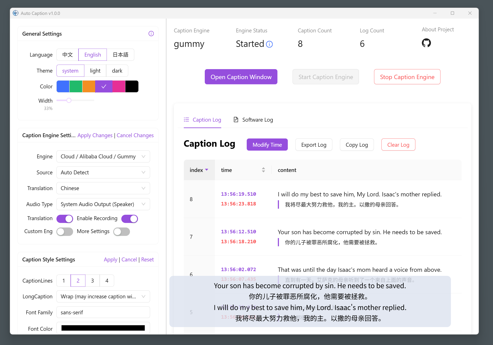
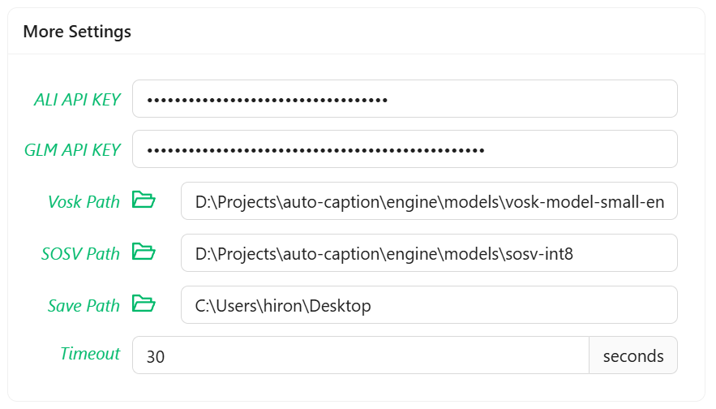
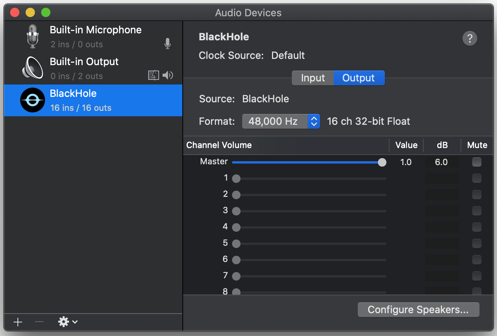
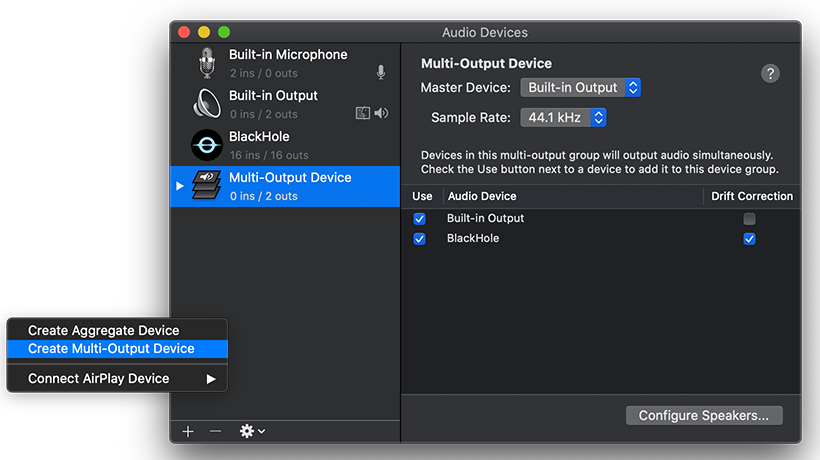
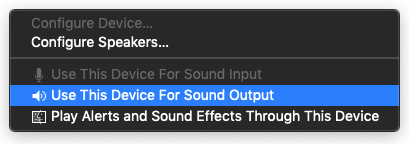
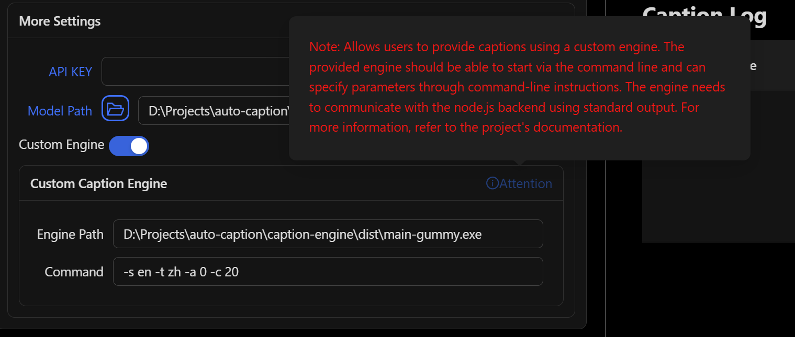

# Auto Caption User Manual

Corresponding Version: v1.0.0

**Note: Due to limited personal resources, the English and Japanese documentation files for this project (except for the README document) will no longer be maintained. The content of this document may not be consistent with the latest version of the project. If you are willing to help with translation, please submit relevant Pull Requests.**

## Software Introduction

Auto Caption is a cross-platform caption display software that can real-time capture system audio input (recording) or output (playback) streaming data and use an audio-to-text model to generate captions for the corresponding audio. The default caption engine provided by the software (using Alibaba Cloud Gummy model) supports recognition and translation in nine languages (Chinese, English, Japanese, Korean, German, French, Russian, Spanish, Italian).

The default caption engine currently has full functionality on Windows, macOS, and Linux platforms. Additional configuration is required to capture system audio output on macOS.

The following operating system versions have been tested and confirmed to work properly. The software cannot guarantee normal operation on untested OS versions.

| OS Version         | Architecture | Audio Input Capture | Audio Output Capture |
| ------------------ | ------------ | ------------------- | -------------------- |
| Windows 11 24H2    | x64          | ✅                   | ✅                    |
| macOS Sequoia 15.5 | arm64        | ✅ Additional config required  | ✅          |
| Ubuntu 24.04.2     | x64          | ✅                   | ✅                    |
| Kali Linux 2022.3  | x64          | ✅                   | ✅                    |
| Kylin Server V10 SP3 | x64 | ✅ | ✅ |



### Software Limitations

To use the Gummy caption engine, you need to obtain an API KEY from Alibaba Cloud.

Additional configuration is required to capture audio output on macOS platform.

The software is built using Electron, so the software size is inevitably large.

## Preparation for Using Gummy Engine

To use the default caption engine provided by the software (Alibaba Cloud Gummy), you need to obtain an API KEY from the Alibaba Cloud Bailian platform. Then add the API KEY to the software settings or configure it in environment variables (only Windows platform supports reading API KEY from environment variables).

**The international version of Alibaba Cloud services does not provide the Gummy model, so non-Chinese users currently cannot use the default caption engine.**

Alibaba Cloud provides detailed tutorials for this part, which can be referenced:

- [Obtaining API KEY (Chinese)](https://help.aliyun.com/zh/model-studio/get-api-key)
- [Configuring API Key through Environment Variables (Chinese)](https://help.aliyun.com/zh/model-studio/configure-api-key-through-environment-variables)

## Preparation for Using Vosk Engine

To use the Vosk local caption engine, first download your required model from the [Vosk Models](https://alphacephei.com/vosk/models) page. Then extract the downloaded model package locally and add the corresponding model folder path to the software settings.



## Using SOSV Model

The way to use the SOSV model is the same as Vosk. The download address is as follows: https://github.com/HiMeditator/auto-caption/releases/tag/sosv-model

## Capturing System Audio Output on macOS

> Based on the [Setup Multi-Output Device](https://github.com/ExistentialAudio/BlackHole/wiki/Multi-Output-Device) tutorial

The caption engine cannot directly capture system audio output on macOS platform and requires additional driver installation. The current caption engine uses [BlackHole](https://github.com/ExistentialAudio/BlackHole). First open Terminal and execute one of the following commands (recommended to choose the first one):

```bash
brew install blackhole-2ch
brew install blackhole-16ch
brew install blackhole-64ch
```



After installation completes, open `Audio MIDI Setup` (searchable via `cmd + space`). Check if BlackHole appears in the device list - if not, restart your computer.



Once BlackHole is confirmed installed, in the `Audio MIDI Setup` page, click the plus (+) button at bottom left and select "Create Multi-Output Device". Include both BlackHole and your desired audio output destination in the outputs. Finally, set this multi-output device as your default audio output device.



Now the caption engine can capture system audio output and generate captions.

## Getting System Audio Output on Linux

First execute in the terminal:

```bash
pactl list short sources
```

If you see output similar to the following, no additional configuration is needed:

```bash
220     alsa_output.pci-0000_02_02.0.3.analog-stereo.monitor    PipeWire        s16le 2ch 48000Hz       SUSPENDED
221     alsa_input.pci-0000_02_02.0.3.analog-stereo     PipeWire        s16le 2ch 48000Hz       SUSPENDED
```

Otherwise, install `pulseaudio` and `pavucontrol` using the following commands:

```bash
# For Debian/Ubuntu etc.
sudo apt install pulseaudio pavucontrol
# For CentOS etc.
sudo yum install pulseaudio pavucontrol
```

## Software Usage

### Modifying Settings

Caption settings can be divided into three categories: general settings, caption engine settings, and caption style settings. Note that changes to general settings take effect immediately. For the other two categories, after making changes, you need to click the "Apply" option in the upper right corner of the corresponding settings module for the changes to take effect. If you click "Cancel Changes," the current modifications will not be saved and will revert to the previous state.

### Starting and Stopping Captions

After completing all configurations, click the "Start Caption Engine" button on the interface to start the captions. If you need a separate caption display window, click the "Open Caption Window" button to activate the independent caption display window. To pause caption recognition, click the "Stop Caption Engine" button.

### Adjusting the Caption Display Window

The following image shows the caption display window, which displays the latest captions in real-time. The three buttons in the upper right corner of the window have the following functions: pin the window to the front, open the caption control window, and close the caption display window. The width of the window can be adjusted by moving the mouse to the left or right edge of the window and dragging the mouse.


### Exporting Caption Records

In the caption control window, you can see the records of all collected captions. Click the "Export Log" button to export the caption records as a JSON or SRT file.

## Caption Engine

The so-called caption engine is essentially a subprogram that captures real-time streaming data from system audio input (recording) or output (playback), and invokes speech-to-text models to generate corresponding captions. The generated captions are converted into JSON-formatted strings and passed to the main program through standard output. The main program reads the caption data, processes it, and displays it in the window.

The software provides two default caption engines. If you need other caption engines, you can invoke them by enabling the custom engine option (other engines need to be specifically developed for this software). The engine path refers to the location of the custom caption engine on your computer, while the engine command represents the runtime parameters of the custom caption engine, which should be configured according to the rules of that particular caption engine.



Note that when using a custom caption engine, all previous caption engine settings will be ineffective, and the configuration of the custom caption engine is entirely done through the engine command.

If you are a developer and want to develop a custom caption engine, please refer to the [Caption Engine Explanation Document](../engine-manual/en.md).
