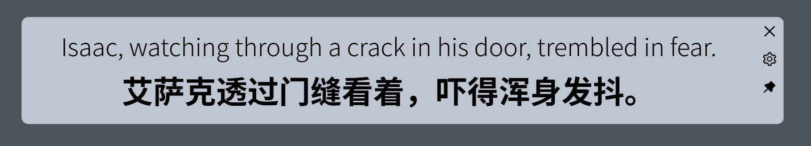

# Auto Caption ユーザーマニュアル

対応バージョン：v0.3.0

この文書は大規模モデルを使用して翻訳されていますので、内容に正確でない部分があるかもしれません。

## ソフトウェアの概要

Auto Caption は、クロスプラットフォームの字幕表示ソフトウェアで、システムの音声入力（録音）または出力（音声再生）のストリーミングデータをリアルタイムで取得し、音声からテキストに変換するモデルを利用して対応する音声の字幕を生成します。このソフトウェアが提供するデフォルトの字幕エンジン（アリババクラウド Gummy モデルを使用）は、9つの言語（中国語、英語、日本語、韓国語、ドイツ語、フランス語、ロシア語、スペイン語、イタリア語）の認識と翻訳をサポートしています。

現在、ソフトウェアのデフォルト字幕エンジンは Windows と macOS プラットフォームでのみ完全な機能を有しています。macOS でシステムオーディオ出力を取得するには追加の設定が必要です。

Linux プラットフォームでは、オーディオ入力（マイク）からの字幕生成のみ可能で、現在オーディオ出力（再生音）からの字幕生成はサポートしていません。


### ソフトウェアの欠点

デフォルトの字幕サービスを使用するには、アリババクラウドの API KEY を取得する必要があります。

macOS プラットフォームでオーディオ出力を取得するには追加の設定が必要です。

ソフトウェアは Electron で構築されているため、そのサイズは避けられないほど大きいです。

## ソフトウェアの使用方法

### 百炼プラットフォームの API KEY の準備

ソフトウェアが提供するデフォルトの字幕エンジン（アリババクラウド Gummy）を使用するには、アリババクラウド百炼プラットフォームから API KEY を取得し、ローカル環境変数に設定する必要があります。

**アリババクラウドの国際版には Gummy モデルが提供されていないため、中国以外のユーザーは現在、デフォルトの字幕エンジンを使用できません。すべてのユーザーが利用できるように、新しいローカルの字幕エンジンを開発中です。**

アリババクラウドは詳細なチュートリアルを提供していますので、以下のリンクを参照してください：

- [API KEY の取得（中国語）](https://help.aliyun.com/zh/model-studio/get-api-key)
- [環境変数を通じて API Key を設定する（中国語）](https://help.aliyun.com/zh/model-studio/configure-api-key-through-environment-variables)

### macOS でのシステムオーディオ出力の取得方法

字幕エンジンは macOS プラットフォームで直接システムオーディオ出力を取得できず、追加のドライバーインストールが必要です。現在の字幕エンジンでは [BlackHole](https://github.com/ExistentialAudio/BlackHole) を使用しています。まずターミナルを開き、以下のいずれかのコマンドを実行してください（最初のオプションを推奨します）：

```bash
brew install blackhole-2ch
brew install blackhole-16ch
brew install blackhole-64ch
```

インストール完了後、`オーディオMIDI設定`（`cmd + space`で検索可能）を開きます。デバイスリストにBlackHoleが表示されているか確認してください - 表示されていない場合はコンピュータを再起動してください。

BlackHoleのインストールが確認できたら、`オーディオ MIDI 設定`ページで左下のプラス(+)ボタンをクリックし、「マルチ出力デバイスを作成」を選択します。出力に BlackHole と希望するオーディオ出力先の両方を含めてください。最後に、このマルチ出力デバイスをデフォルトのオーディオ出力デバイスに設定します。

これで字幕エンジンがシステムオーディオ出力をキャプチャし、字幕を生成できるようになります。

### 設定の変更

字幕の設定は3つのカテゴリーに分かれます：一般的な設定、字幕エンジンの設定、字幕スタイルの設定。注意すべき点として、一般的な設定の変更は即座に適用されます。しかし、他の2つの設定については、変更後に該当する設定モジュール右上の「適用」オプションをクリックすることで初めて変更が有効になります。「変更を取り消す」を選択すると、現在の変更は保存されず、前回の状態に戻ります。

### 字幕の開始と停止

すべての設定を完了したら、インターフェースの「字幕エンジンを開始」ボタンをクリックして字幕を開始できます。独立した字幕表示ウィンドウが必要な場合は、インターフェースの「字幕ウィンドウを開く」ボタンをクリックして独立した字幕表示ウィンドウをアクティブ化します。字幕認識を一時停止する必要がある場合は、「字幕エンジンを停止」ボタンをクリックします。

### 字幕表示ウィンドウの調整

下の図は字幕表示ウィンドウです。このウィンドウは現在の最新の字幕をリアルタイムで表示します。ウィンドウの右上にある3つのボタンの機能はそれぞれ次の通りです：ウィンドウを最前面に固定する、字幕制御ウィンドウを開く、字幕表示ウィンドウを閉じる。このウィンドウの幅は調整可能です。マウスをウィンドウの左右の端に移動し、ドラッグして幅を調整します。



### 字幕記録のエクスポート

字幕制御ウィンドウでは、現在収集されたすべての字幕の記録を見ることができます。「字幕記録をエクスポート」ボタンをクリックすると、字幕記録をJSONファイルとしてエクスポートできます。

## 字幕エンジン

字幕エンジンとは、実際にはサブプログラムであり、システムの音声入力（録音）または出力（音声再生）のストリーミングデータをリアルタイムで取得し、音声からテキストに変換するモデルを利用して対応する音声の字幕を生成します。生成された字幕はIPC経由で文字列に変換されたJSONデータとして出力され、メインプログラムに返されます。メインプログラムは字幕データを読み取り、処理してウィンドウ上に表示します。

ソフトウェアはデフォルトの字幕エンジンを提供しており、他の字幕エンジンが必要な場合は、カスタムエンジンオプションを開いて他の字幕エンジンを呼び出すことができます（他のエンジンはこのソフトウェアに対して開発する必要があります）。エンジンパスは、あなたのコンピュータ上のカスタム字幕エンジンのパスであり、エンジンコマンドはカスタム字幕エンジンの実行パラメータです。これらの部分は、その字幕エンジンの規則に従って記入する必要があります。


カスタム字幕エンジンを使用する場合、前の字幕エンジンの設定はすべて無効になります。カスタム字幕エンジンの設定は完全にエンジンコマンドによって行われます。

開発者の方で、カスタム字幕エンジンを開発したい場合は、[字幕エンジン説明文書](../engine-manual/ja.md)をご覧ください。
