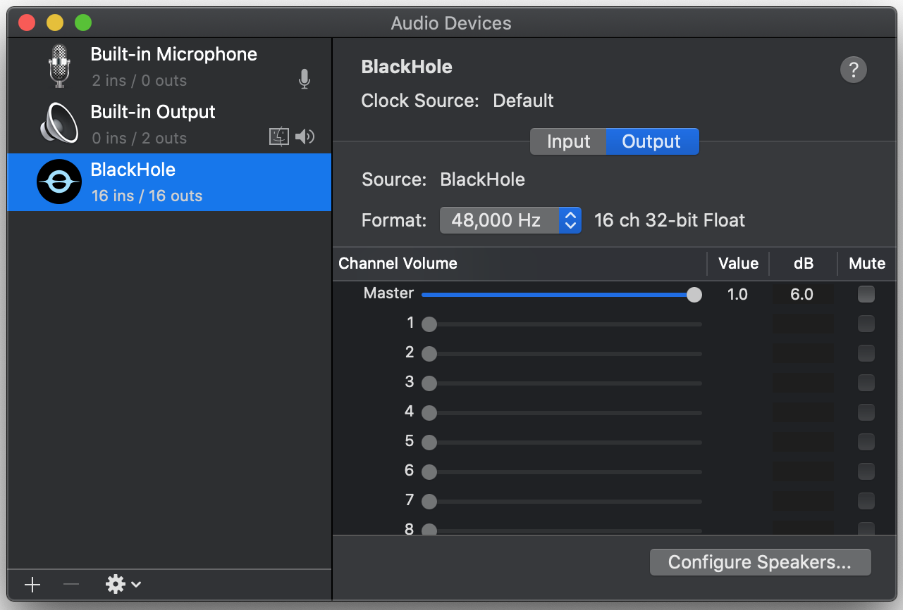
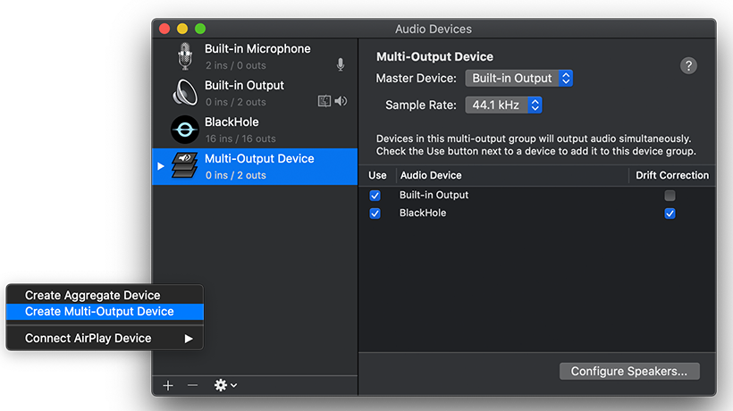

# Auto Caption ユーザーマニュアル

対応バージョン：v1.1.0

この文書は大規模モデルを使用して翻訳されていますので、内容に正確でない部分があるかもしれません。

## ソフトウェアの概要

Auto Caption は、クロスプラットフォームの字幕表示ソフトウェアで、システムの音声入力（録音）または出力（音声再生）のストリーミングデータをリアルタイムで取得し、音声からテキストに変換するモデルを利用して対応する音声の字幕を生成します。このソフトウェアが提供するデフォルトの字幕エンジン（アリババクラウド Gummy モデルを使用）は、9つの言語（中国語、英語、日本語、韓国語、ドイツ語、フランス語、ロシア語、スペイン語、イタリア語）の認識と翻訳をサポートしています。

現在のデフォルト字幕エンジンは Windows、macOS、Linux プラットフォームで完全な機能を有しています。macOSでシステムのオーディオ出力を取得するには追加設定が必要です。

以下のオペレーティングシステムバージョンで正常動作を確認しています。記載以外の OS での正常動作は保証できません。

| OS バージョン        | アーキテクチャ | オーディオ入力取得 | オーディオ出力取得 |
| ------------------- | ------------- | ------------------ | ------------------ |
| Windows 11 24H2     | x64           | ✅                  | ✅                  |
| macOS Sequoia 15.5  | arm64         | ✅ 追加設定が必要      | ✅                  |
| Ubuntu 24.04.2      | x64           | ✅                  | ✅                  |
| Kali Linux 2022.3   | x64           | ✅                  | ✅                  |
| Kylin Server V10 SP3 | x64 | ✅ | ✅ |


### ソフトウェアの欠点

Gummy 字幕エンジンを使用するには、アリババクラウドの API KEY を取得する必要があります。

macOS プラットフォームでオーディオ出力を取得するには追加の設定が必要です。

ソフトウェアは Electron で構築されているため、そのサイズは避けられないほど大きいです。

## Gummyエンジン使用前の準備

ソフトウェアが提供するデフォルトの字幕エンジン（Alibaba Cloud Gummy）を使用するには、Alibaba Cloud百煉プラットフォームからAPI KEYを取得する必要があります。その後、API KEYをソフトウェア設定に追加するか、環境変数に設定します（Windowsプラットフォームのみ環境変数からのAPI KEY読み取りをサポート）。

**Alibaba Cloudの国際版サービスではGummyモデルを提供していないため、現在中国以外のユーザーはデフォルトの字幕エンジンを使用できません。**

この部分についてAlibaba Cloudは詳細なチュートリアルを提供しており、以下を参照できます：

- [API KEY の取得（中国語）](https://help.aliyun.com/zh/model-studio/get-api-key)
- [環境変数を通じて API Key を設定（中国語）](https://help.aliyun.com/zh/model-studio/configure-api-key-through-environment-variables)

## GLM エンジン使用前の準備

まずAPI KEYを取得する必要があります。参考：[クイックスタート](https://docs.bigmodel.cn/en/guide/start/quick-start)。

## Voskエンジン使用前の準備

Voskローカル字幕エンジンを使用するには、まず[Vosk Models](https://alphacephei.com/vosk/models)ページから必要なモデルをダウンロードしてください。その後、ダウンロードしたモデルパッケージをローカルに解凍し、対応するモデルフォルダのパスをソフトウェア設定に追加します。


## SOSVモデルの使用

SOSVモデルの使用方法はVoskと同じで、ダウンロードアドレスは以下の通りです：https://github.com/HiMeditator/auto-caption/releases/tag/sosv-model

## macOS でのシステムオーディオ出力の取得方法

> [マルチ出力デバイスの設定](https://github.com/ExistentialAudio/BlackHole/wiki/Multi-Output-Device) チュートリアルに基づいて作成


字幕エンジンは macOS プラットフォームで直接システムオーディオ出力を取得できず、追加のドライバーインストールが必要です。現在の字幕エンジンでは [BlackHole](https://github.com/ExistentialAudio/BlackHole) を使用しています。まずターミナルを開き、以下のいずれかのコマンドを実行してください（最初のオプションを推奨します）：

```bash
brew install blackhole-2ch
brew install blackhole-16ch
brew install blackhole-64ch
```



インストール完了後、`オーディオMIDI設定`（`cmd + space`で検索可能）を開きます。デバイスリストにBlackHoleが表示されているか確認してください - 表示されていない場合はコンピュータを再起動してください。



BlackHoleのインストールが確認できたら、`オーディオ MIDI 設定`ページで左下のプラス(+)ボタンをクリックし、「マルチ出力デバイスを作成」を選択します。出力に BlackHole と希望するオーディオ出力先の両方を含めてください。最後に、このマルチ出力デバイスをデフォルトのオーディオ出力デバイスに設定します。


これで字幕エンジンがシステムオーディオ出力をキャプチャし、字幕を生成できるようになります。

## Linux でシステムオーディオ出力を取得する

まずターミナルで以下を実行してください:

```bash
pactl list short sources
```

以下のような出力が確認できれば追加設定は不要です:

```bash
220     alsa_output.pci-0000_02_02.0.3.analog-stereo.monitor    PipeWire        s16le 2ch 48000Hz       SUSPENDED
221     alsa_input.pci-0000_02_02.0.3.analog-stereo     PipeWire        s16le 2ch 48000Hz       SUSPENDED
```

それ以外の場合は、以下のコマンドで`pulseaudio`と`pavucontrol`をインストールしてください:

```bash
# Debian/Ubuntu系の場合
sudo apt install pulseaudio pavucontrol
# CentOS系の場合
sudo yum install pulseaudio pavucontrol
```

## ソフトウェアの使い方

### 設定の変更

字幕の設定は3つのカテゴリーに分かれます：一般的な設定、字幕エンジンの設定、字幕スタイルの設定。注意すべき点として、一般的な設定の変更は即座に適用されます。しかし、他の2つの設定については、変更後に該当する設定モジュール右上の「適用」オプションをクリックすることで初めて変更が有効になります。「変更を取り消す」を選択すると、現在の変更は保存されず、前回の状態に戻ります。

### 字幕の開始と停止

すべての設定を完了したら、インターフェースの「字幕エンジンを開始」ボタンをクリックして字幕を開始できます。独立した字幕表示ウィンドウが必要な場合は、インターフェースの「字幕ウィンドウを開く」ボタンをクリックして独立した字幕表示ウィンドウをアクティブ化します。字幕認識を一時停止する必要がある場合は、「字幕エンジンを停止」ボタンをクリックします。

### 字幕表示ウィンドウの調整

下の図は字幕表示ウィンドウです。このウィンドウは現在の最新の字幕をリアルタイムで表示します。ウィンドウの右上にある3つのボタンの機能はそれぞれ次の通りです：ウィンドウを最前面に固定する、字幕制御ウィンドウを開く、字幕表示ウィンドウを閉じる。このウィンドウの幅は調整可能です。マウスをウィンドウの左右の端に移動し、ドラッグして幅を調整します。


### 字幕記録のエクスポート

「エクスポート」ボタンをクリックすると、字幕記録を JSON または SRT ファイル形式で出力できます。

## 字幕エンジン

字幕エンジンとは、システムのオーディオ入力（録音）または出力（再生音）のストリーミングデータをリアルタイムで取得し、音声テキスト変換モデルを呼び出して対応する字幕を生成するサブプログラムです。生成された字幕は JSON 形式の文字列に変換され、標準出力を通じてメインプログラムに渡されます。メインプログラムは字幕データを読み取り、処理した後、ウィンドウに表示します。

ソフトウェアには2つのデフォルトの字幕エンジンが用意されています。他の字幕エンジンが必要な場合、カスタムエンジンオプションを有効にすることで呼び出すことができます（他のエンジンはこのソフトウェア向けに特別に開発する必要があります）。エンジンパスはコンピュータ上のカスタム字幕エンジンの場所を指し、エンジンコマンドはカスタム字幕エンジンの実行パラメータを表します。これらは該当する字幕エンジンの規則に従って設定する必要があります。


カスタム字幕エンジンを使用する場合、前の字幕エンジンの設定はすべて無効になります。カスタム字幕エンジンの設定は完全にエンジンコマンドによって行われます。

開発者の方で、カスタム字幕エンジンを開発したい場合は、[字幕エンジン説明文書](../engine-manual/ja.md)をご覧ください。
