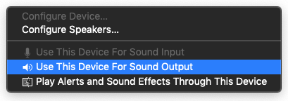

# Auto Caption 用户手册

对应版本：v1.1.0

## 软件简介

Auto Caption 是一个跨平台的字幕显示软件，能够实时获取系统音频输入（录音）或输出（播放声音）的流式数据，并调用音频转文字的模型生成对应音频的字幕。软件提供的默认字幕引擎（使用阿里云 Gummy 模型）支持九种语言（中、英、日、韩、德、法、俄、西、意）的识别与翻译。

目前软件默认字幕引擎在 Windows、 macOS 和 Linux 平台下均拥有完整功能，在 macOS 要获取系统音频输出需要额外配置。

测试过可正常运行的操作系统信息如下，软件不能保证在非下列版本的操作系统上正常运行。

| 操作系统版本        | 处理器架构 | 获取系统音频输入 | 获取系统音频输出 |
| ------------------ | ---------- | ---------------- | ---------------- |
| Windows 11 24H2    | x64        | ✅                | ✅                |
| macOS Sequoia 15.5 | arm64      | ✅需要额外配置    | ✅                |
| Ubuntu 24.04.2     | x64        | ✅    | ✅                |
| Kali Linux 2022.3     | x64        | ✅    | ✅                |
| Kylin Server V10 SP3 | x64 | ✅ | ✅ |


### 软件缺点

要使用默认的 Gummy 字幕引擎需要获取阿里云的 API KEY。

在 macOS 平台获取音频输出需要额外配置。

软件使用 Electron 构建，因此软件体积不可避免的较大。

## Gummy 引擎使用前准备

要使用软件提供的默认字幕引擎（阿里云 Gummy），需要从阿里云百炼平台获取 API KEY，然后将 API KEY 添加到软件设置中或者配置到环境变量中（仅 Windows 平台支持读取环境变量中的 API KEY）。

**国际版的阿里云服务并没有提供 Gummy 模型，因此目前非中国用户无法使用默认字幕引擎。**

这部分阿里云提供了详细的教程，可参考：

- [获取 API KEY](https://help.aliyun.com/zh/model-studio/get-api-key)
- [将 API Key 配置到环境变量](https://help.aliyun.com/zh/model-studio/configure-api-key-through-environment-variables)

## GLM 引擎使用前准备

需要先获取 API KEY，参考：[Quick Start](https://docs.bigmodel.cn/en/guide/start/quick-start)。

## Vosk 引擎使用前准备

如果要使用 Vosk 本地字幕引擎，首先需要在 [Vosk Models](https://alphacephei.com/vosk/models) 页面下载你需要的模型。然后将下载的模型安装包解压到本地，并将对应的模型文件夹的路径添加到软件的设置中。


## 使用 SOSV 模型

使用 SOSV 模型的方式和 Vosk 一样，下载地址如下：https://github.com/HiMeditator/auto-caption/releases/tag/sosv-model

## macOS 获取系统音频输出

> 基于 [Setup Multi-Output Device](https://github.com/ExistentialAudio/BlackHole/wiki/Multi-Output-Device) 教程编写

字幕引擎无法在 macOS 平台直接获取系统的音频输出，需要安装额外的驱动。目前字幕引擎采用的是 [BlackHole](https://github.com/ExistentialAudio/BlackHole)。首先打开终端，执行以下命令中的其中一个（建议选择第一个）：

```bash
brew install blackhole-2ch
brew install blackhole-16ch
brew install blackhole-64ch
```


安装完成后打开 `音频 MIDI 设置`（`cmd + space` 打开搜索，可以搜索到）。观察设备列表中是否有 BlackHole 设备，如果没有需要重启电脑。


在确定安装好 BlackHole 设备后，在 `音频 MIDI 设置` 页面，点击左下角的加号，选择“创建多输出设备”。在输出中包含 BlackHole 和你想要的音频输出目标。最后将该多输出设备设置为默认音频输出设备。



现在字幕引擎就能捕获系统的音频输出并生成字幕了。

## Linux 获取系统音频输出

首先在控制台执行：

```bash
pactl list short sources
```

如果有以下类似的输出内容则无需额外配置：

```bash
220     alsa_output.pci-0000_02_02.0.3.analog-stereo.monitor    PipeWire        s16le 2ch 48000Hz       SUSPENDED
221     alsa_input.pci-0000_02_02.0.3.analog-stereo     PipeWire        s16le 2ch 48000Hz       SUSPENDED
```

否则，执行以下命令安装 `pulseaudio` 和 `pavucontrol`：

```bash
# Debian or Ubuntu, etc.
sudo apt install pulseaudio pavucontrol
# CentOS, etc.
sudo yum install pulseaudio pavucontrol
```

## 软件使用

### 修改设置

字幕设置可以分为三类：通用设置、字幕引擎设置、字幕样式设置。需要注意的是，修改通用设置是立即生效的。但是对于其他两类设置，修改后需要点击对应设置模块右上角的“应用”选项，更改才会真正生效。如果点击“取消更改”那么当前修改将不会被保存，而是回退到上次修改的状态。

### 启动和关闭字幕

在修改完全部配置后，点击界面的“启动字幕引擎”按钮，即可启动字幕。如果需要独立的字幕展示窗口，单击界面的“打开字幕窗口”按钮即可激活独立的字幕展示窗口。如果需要暂停字幕识别，单击界面的“关闭字幕引擎”按钮即可。

### 调整字幕展示窗口

如下图为字幕展示窗口，该窗口实时展示当前最新字幕。窗口右上角三个按钮的功能分别是：将窗口固定在最前面、打开字幕控制窗口、关闭字幕展示窗口。该窗口宽度可以调整，将鼠标移动至窗口的左右边缘，拖动鼠标即可调整宽度。


### 字幕记录的导出

在字幕控制窗口中可以看到当前收集的所有字幕的记录，点击“导出字幕”按钮，即可将字幕记录导出为 JSON 或 SRT 文件。

## 字幕引擎

所谓的字幕引擎实际上是一个子程序，它会实时获取系统音频输入（录音）或输出（播放声音）的流式数据，并调用音频转文字的模型生成对应音频的字幕。生成的字幕通过转换为字符串的 JSON 数据，并通过标准输出传递给主程序。主程序读取字幕数据，处理后显示在窗口上。

软件提供了两个默认的字幕引擎，如果你需要其他的字幕引擎，可以通过打开自定义引擎选项来调用其他字幕引擎（其他引擎需要针对该软件进行开发）。其中引擎路径是自定义字幕引擎在你的电脑上的路径，引擎指令是自定义字幕引擎的运行参数，这部分需要按该字幕引擎的规则进行填写。


注意使用自定义字幕引擎时，前面的字幕引擎的设置将全部不起作用，自定义字幕引擎的配置完全通过引擎指令进行配置。

如果你是开发者，想开发自定义字幕引擎，请查看[字幕引擎说明文档](../engine-manual/zh.md)。

## 单独使用字幕引擎

### 运行参数说明

> 以下内容默认用户对使用终端运行程序有一定了解。

字幕引擎可用使用的完整的运行参数如下：


而在单独使用时其中某些参数并不需要使用，或者不适合进行修改。

下面的运行参数说明仅包含必要的参数。

#### `-e , --caption_engine`

需要选择的字幕引擎模型，目前有四个可用，分别为：`gummy, glm, vosk, sosv`。

该项的默认值为 `gummy`。

该项适用于所有模型。

#### `-a, --audio_type`

需要识别的音频类型，其中 `0` 表示系统音频输出，`1` 表示麦克风音频输入。

该项的默认值为 `0`。

该项适用于所有模型。

#### `-d, --display_caption`

是否在控制台显示字幕，`0` 表示不显示，`1` 表示显示。

该项默认值为 `0`，只使用字幕引擎的话建议选 `1`。

该项适用于所有模型。

#### `-t, --target_language`

> 其中 Vosk 和 SOSV 模型分句效果较差，会导致翻译内容难以理解，不太建议这两个模型使用翻译。

需要翻译成的目标语言，所有模型都支持的翻译语言如下：

- `none` 不进行翻译
- `zh` 简体中文
- `en` 英语
- `ja` 日语
- `ko` 韩语

除此之外 `vosk` 和 `sosv` 模型还支持如下翻译：

- `de` 德语
- `fr` 法语
- `ru` 俄语
- `es` 西班牙语
- `it` 意大利语

该项的默认值为 `none`。

该项适用于所有模型。

#### `-s, --source_language`

需要识别的语言的源语言，默认值为 `auto`，表示不指定源语言。

但是指定源语言能在一定程度上提高识别准确率，可用使用上面的语言代码指定源语言。

该项适用于 Gummy、GLM 和 SOSV 模型。

其中 Gummy 模型可用使用上述全部的语言，在加上粤语（`yue`）。

GLM 模型支持指定的语言有：英语、中文、日语、韩语。

SOSV 模型支持指定的语言有：英语、中文、日语、韩语、粤语。

#### `-k, --api_key`

指定 `Gummy` 模型需要使用的阿里云 API KEY。

该项默认值为空。

该项仅适用于 Gummy 模型。

#### `-gkey, --glm_api_key`

指定 `glm` 模型需要使用的 API KEY，默认为空。

#### `-gmodel, --glm_model`

指定 `glm` 模型需要使用的模型名称，默认为 `glm-asr-2512`。

#### `-gurl, --glm_url`

指定 `glm` 模型需要使用的 API URL，默认值为：`https://open.bigmodel.cn/api/paas/v4/audio/transcriptions`。

#### `-tm, --translation_model`

指定 Vosk 和 SOSV 模型的翻译方式，默认为 `ollama`。

该项支持的值有：

- `ollama` 使用本地 Ollama 模型进行翻译，需要用户安装 Ollama 软件和对应的模型
- `google` 使用 Google 翻译 API 进行翻译，无需额外配置，但是需要有能访问 Google 的网络

该项仅适用于 Vosk 和 SOSV 模型。

#### `-omn, --ollama_name`

指定要使用的翻译模型名称，可以是 Ollama 本地模型，也可以是 OpenAI API 兼容的云端模型。若未填写 Base URL 字段，则默认调用本地 Ollama 服务，否则会通过 Python OpenAI 库调用该地址指向的 API 服务。

如果使用 Ollama 模型，建议使用参数量小于 1B 的模型，比如： `qwen2.5:0.5b`, `qwen3:0.6b`。需要在 Ollama 中下载了对应的模型才能正常使用。

默认值为空，适用于除了 Gummy 外的其他模型。

#### `-ourl, --ollama_url`

调用 OpenAI API 的基础请求地址，如果不填写则调用本地默认端口的 Ollama 模型。

默认值为空，适用于除了 Gummy 外的其他模型。

#### `-okey, --ollama_api_key`

指定调用 OpenAI 兼容模型的 API KEY。

默认值为空，适用于除了 Gummy 外的其他模型。

#### `-vosk, --vosk_model`

指定需要调用的 Vosk 模型的本地文件夹的路径。该项默认值为空。

该项仅适用于 Vosk  模型。

#### `-sosv, --sosv_model`

指定需要调用的 SOSV 模型的本地文件夹的路径。该项默认值为空。

该项仅适用于 SOSV  模型。

### 使用源代码运行字幕引擎

> 以下内容默认使用该方式的用户对 Python 环境配置和使用有所了解。

首先下载项目源代码到本地，其中字幕引擎源代码在项目的 `engine` 目录下。然后配置 Python 环境，其中项目依赖的 Python 包在 `engine` 目录下 `requirements.txt` 文件中。

配置好后进入 `engine` 目录，执行命令进行运行字幕引擎。

比如要使用 Gummy 模型，指定音频类型为系统音频输出，源语言为英语，翻译语言为中文，执行的命令如下：

> 注意：为了更直观，下面的命令写在了多行，如果执行失败，尝试去掉反斜杠，并改换单行命令执行。

```bash
python main.py \
-e gummy \
-k sk-******************************** \
-a 0 \
-d 1 \
-s en \
-t zh
```

指定 Vosk 模型，指定音频类型为系统音频输出，翻译语言为英语，使用 Ollama `qwen3:0.6b` 模型进行翻译：

```bash
python main.py \
-e vosk \
-vosk D:\Projects\auto-caption\engine\models\vosk-model-small-cn-0.22 \
-a 0 \
-d 1 \
-t en \
```

指定 SOSV 模型，指定音频类型为麦克风，自动选择源语言，不翻译，执行的命令如下：

```bash
python main.py \
-e sosv \
-sosv D:\\Projects\\auto-caption\\engine\\models\\sosv-int8 \
-a 1 \
-d 1 \
-s auto \
-t none
```

使用 Gummy 模型的运行效果如下：


### 运行字幕引擎可执行文件

首先在 [GitHub Release](https://github.com/HiMeditator/auto-caption/releases/tag/engine) 中下载对应平台的可执行文件（目前仅提供 Windows 和 Linux 平台的字幕引擎可执行文件）。

然后再字幕引擎可执行文件所在目录打开终端，执行命令进行运行字幕引擎。

只需要将上述指令中的 `python main.py` 替换为可执行文件名称即可（比如：`engine-win.exe`）。