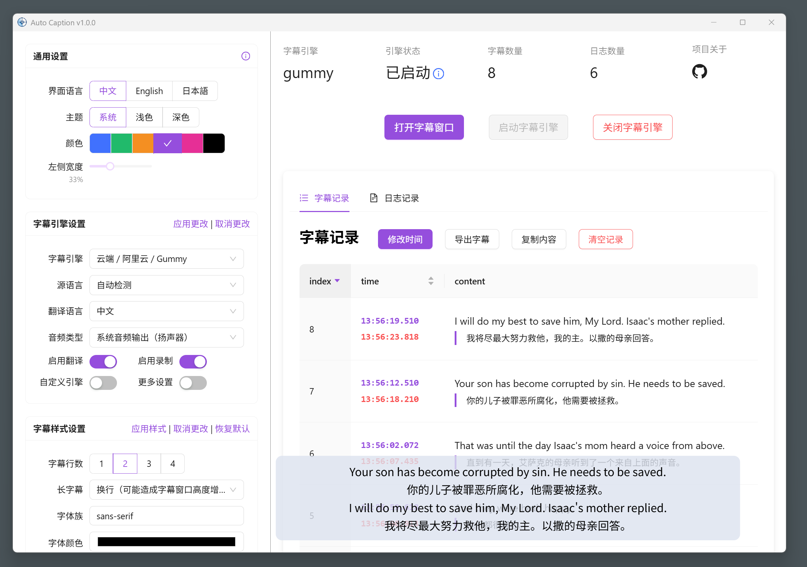
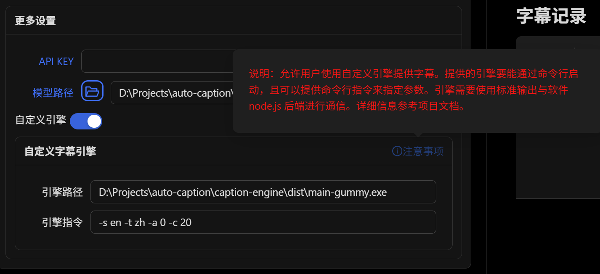

# Auto Caption 用户手册

对应版本：v0.6.0

## 软件简介

Auto Caption 是一个跨平台的字幕显示软件，能够实时获取系统音频输入（录音）或输出（播放声音）的流式数据，并调用音频转文字的模型生成对应音频的字幕。软件提供的默认字幕引擎（使用阿里云 Gummy 模型）支持九种语言（中、英、日、韩、德、法、俄、西、意）的识别与翻译。

目前软件默认字幕引擎在 Windows、 macOS 和 Linux 平台下均拥有完整功能，在 macOS 要获取系统音频输出需要额外配置。

测试过可正常运行的操作系统信息如下，软件不能保证在非下列版本的操作系统上正常运行。

| 操作系统版本        | 处理器架构 | 获取系统音频输入 | 获取系统音频输出 |
| ------------------ | ---------- | ---------------- | ---------------- |
| Windows 11 24H2    | x64        | ✅                | ✅                |
| macOS Sequoia 15.5 | arm64      | ✅需要额外配置    | ✅                |
| Ubuntu 24.04.2     | x64        | ✅    | ✅                |
| Kali Linux 2022.3     | x64        | ✅    | ✅                |
| Kylin Server V10 SP3 | x64 | ✅ | ✅ |



### 软件缺点

要使用默认的 Gummy 字幕引擎需要获取阿里云的 API KEY。

在 macOS 平台获取音频输出需要额外配置。

软件使用 Electron 构建，因此软件体积不可避免的较大。

## Gummy 引擎使用前准备

要使用软件提供的默认字幕引擎（阿里云 Gummy），需要从阿里云百炼平台获取 API KEY，然后将 API KEY 添加到软件设置中或者配置到环境变量中（仅 Windows 平台支持读取环境变量中的 API KEY）。

**国际版的阿里云服务并没有提供 Gummy 模型，因此目前非中国用户无法使用默认字幕引擎。**

这部分阿里云提供了详细的教程，可参考：

- [获取 API KEY](https://help.aliyun.com/zh/model-studio/get-api-key)
- [将 API Key 配置到环境变量](https://help.aliyun.com/zh/model-studio/configure-api-key-through-environment-variables)

## Vosk 引擎使用前准备

如果要使用 Vosk 本地字幕引擎，首先需要在 [Vosk Models](https://alphacephei.com/vosk/models) 页面下载你需要的模型。然后将下载的模型安装包解压到本地，并将对应的模型文件夹的路径添加到软件的设置中。目前 Vosk 字幕引擎还不支持翻译字幕内容。


## macOS 获取系统音频输出

> 基于 [Setup Multi-Output Device](https://github.com/ExistentialAudio/BlackHole/wiki/Multi-Output-Device) 教程编写

字幕引擎无法在 macOS 平台直接获取系统的音频输出，需要安装额外的驱动。目前字幕引擎采用的是 [BlackHole](https://github.com/ExistentialAudio/BlackHole)。首先打开终端，执行以下命令中的其中一个（建议选择第一个）：

```bash
brew install blackhole-2ch
brew install blackhole-16ch
brew install blackhole-64ch
```


安装完成后打开 `音频 MIDI 设置`（`cmd + space` 打开搜索，可以搜索到）。观察设备列表中是否有 BlackHole 设备，如果没有需要重启电脑。


在确定安装好 BlackHole 设备后，在 `音频 MIDI 设置` 页面，点击左下角的加号，选择“创建多输出设备”。在输出中包含 BlackHole 和你想要的音频输出目标。最后将该多输出设备设置为默认音频输出设备。


现在字幕引擎就能捕获系统的音频输出并生成字幕了。

## Linux 获取系统音频输出

首先在控制台执行：

```bash
pactl list short sources
```

如果有以下类似的输出内容则无需额外配置：

```bash
220     alsa_output.pci-0000_02_02.0.3.analog-stereo.monitor    PipeWire        s16le 2ch 48000Hz       SUSPENDED
221     alsa_input.pci-0000_02_02.0.3.analog-stereo     PipeWire        s16le 2ch 48000Hz       SUSPENDED
```

否则，执行以下命令安装 `pulseaudio` 和 `pavucontrol`：

```bash
# Debian or Ubuntu, etc.
sudo apt install pulseaudio pavucontrol
# CentOS, etc.
sudo yum install pulseaudio pavucontrol
```

## 软件使用

### 修改设置

字幕设置可以分为三类：通用设置、字幕引擎设置、字幕样式设置。需要注意的是，修改通用设置是立即生效的。但是对于其他两类设置，修改后需要点击对应设置模块右上角的“应用”选项，更改才会真正生效。如果点击“取消更改”那么当前修改将不会被保存，而是回退到上次修改的状态。

### 启动和关闭字幕

在修改完全部配置后，点击界面的“启动字幕引擎”按钮，即可启动字幕。如果需要独立的字幕展示窗口，单击界面的“打开字幕窗口”按钮即可激活独立的字幕展示窗口。如果需要暂停字幕识别，单击界面的“关闭字幕引擎”按钮即可。

### 调整字幕展示窗口

如下图为字幕展示窗口，该窗口实时展示当前最新字幕。窗口右上角三个按钮的功能分别是：将窗口固定在最前面、打开字幕控制窗口、关闭字幕展示窗口。该窗口宽度可以调整，将鼠标移动至窗口的左右边缘，拖动鼠标即可调整宽度。


### 字幕记录的导出

在字幕控制窗口中可以看到当前收集的所有字幕的记录，点击“导出字幕”按钮，即可将字幕记录导出为 JSON 或 SRT 文件。

## 字幕引擎

所谓的字幕引擎实际上是一个子程序，它会实时获取系统音频输入（录音）或输出（播放声音）的流式数据，并调用音频转文字的模型生成对应音频的字幕。生成的字幕通过转换为字符串的 JSON 数据，并通过标准输出传递给主程序。主程序读取字幕数据，处理后显示在窗口上。

软件提供了两个默认的字幕引擎，如果你需要其他的字幕引擎，可以通过打开自定义引擎选项来调用其他字幕引擎（其他引擎需要针对该软件进行开发）。其中引擎路径是自定义字幕引擎在你的电脑上的路径，引擎指令是自定义字幕引擎的运行参数，这部分需要按该字幕引擎的规则进行填写。



注意使用自定义字幕引擎时，前面的字幕引擎的设置将全部不起作用，自定义字幕引擎的配置完全通过引擎指令进行配置。

如果你是开发者，想开发自定义字幕引擎，请查看[字幕引擎说明文档](../engine-manual/zh.md)。
